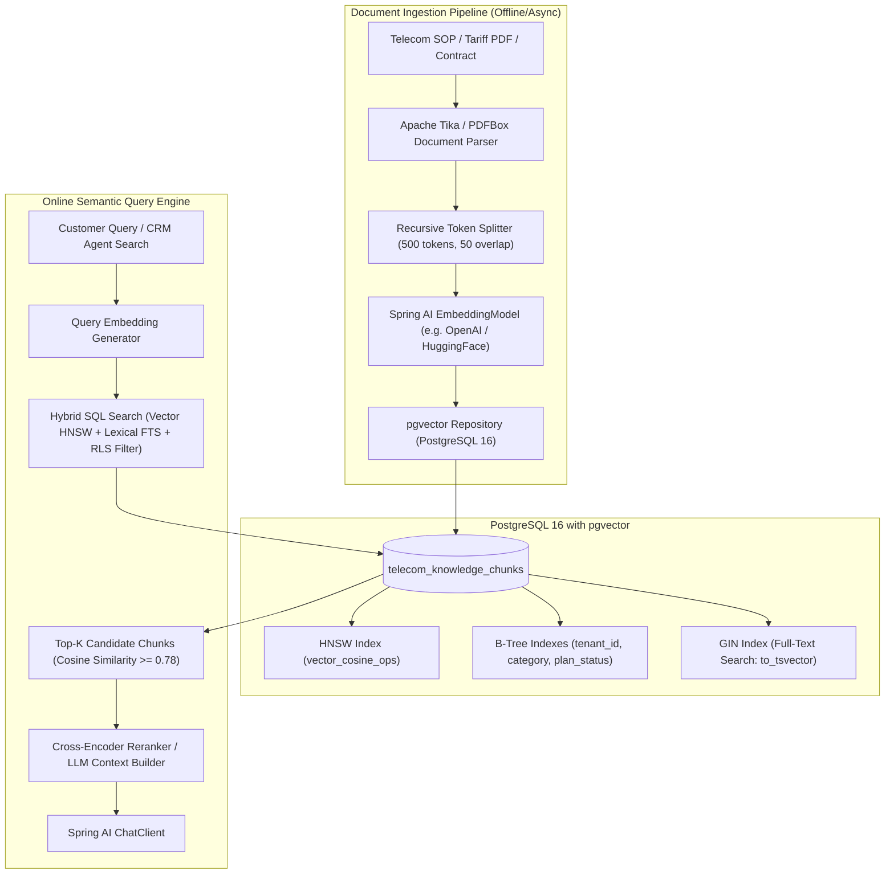

# 13. Embeddings, Vector Databases & pgvector: Senior Architecture Guide
> **Evidence warning:** Embeddings and vector databases are learning targets. Telecom projects, metrics, and provider names are illustrative unless independently evidenced.
**Target Profile:** Senior Product Software Engineer / AI-Enabled Backend Engineer (Vector Search, Embeddings, PostgreSQL pgvector, HNSW vs. IVFFlat, Hybrid Search)  
**Author:** Siva Prasad Vajja  
**Domain Alignment:** Telecom CRM, Enterprise Knowledge Bases, Tariff Catalog Matching, Multi-Tenant SaaS  

---

## 1. Definition
**Vector Embeddings at the Senior Engineering Level** are dense, continuous numerical vector representations ($\vec{v} \in \mathbb{R}^d$, typically $d \in [384, 1536, 3072]$) produced by deep neural networks (e.g., OpenAI `text-embedding-3-small`, Cohere `embed-v3`, or HuggingFace `bge-large`). They project discrete semantic tokens into a continuous geometric latent space where semantic proximity is mathematically equivalent to spatial proximity.

A **Vector Database** is a specialized storage and indexing engine optimized for **Approximate Nearest Neighbor (ANN)** retrieval across millions of high-dimensional vectors under strict latency SLAs ($< 15$ms).  
**`pgvector`** is the native open-source vector similarity search extension for **PostgreSQL**. It allows enterprise applications to store vector embeddings directly alongside transactional relational data, leveraging PostgreSQL ACID guarantees, connection pooling, and Row-Level Security (RLS) while eliminating the operational complexity of dedicated vector databases.

---

## 2. Why It Exists
In enterprise platforms (such as Telecom BSS/CRM and multi-tenant SaaS):
1. **The Lexical Search Failure:** Traditional relational B-Trees and full-text inverted indexes (PostgreSQL `tsvector` or Elasticsearch) match exact keywords and stems. They completely fail when a customer searches for *"cheap roaming pass for France travel"*, but the telecom product catalog describes it as *"International Data Pack — Western Europe Tier 1"*.
2. **The Dual-Database Synchronization Problem:** Introducing a dedicated standalone vector database (e.g., Pinecone, Milvus, Qdrant) introduces distributed systems hazards: dual writes, split-brain consistency bugs, separate backup lifecycles, and CDC (Change Data Capture) lag via Debezium.
3. **Unified Relational + Semantic Querying:** Enterprises rarely search vectors in isolation. A real query requires: *"Find top-5 tariff plans semantically similar to this customer query, BUT ONLY where `tenant_id = 'TELCO_US'`, `status = 'ACTIVE'`, and `min_prepaid_balance <= 50`."* `pgvector` performs this in a single atomic SQL query.

---

## 3. Problem It Solves
* **Semantic Mismatch & Polysemy:** Translates human phrasing into semantic geometry, understanding that *"barred SIM"*, *"suspended line"*, and *"blocked network access"* point to the same concept.
* **Operational Footprint Bloat:** Eliminates the need to maintain, patch, and monitor a separate vector database cluster alongside PostgreSQL.
* **Data Consistency & Isolation:** Leverages PostgreSQL transactional ACID semantics, WAL (Write-Ahead Logging), and Row-Level Security (RLS) for tenant isolation.
* **Hybrid Search Disconnect:** Seamlessly combines lexical BM25/FTS search with dense semantic vector search via Reciprocal Rank Fusion (RRF) inside SQL.

---

## 4. Internal Working

### 4.1 Embedding Dimensions & Distance Metrics
When text is converted into an embedding vector $\vec{v} = [x_1, x_2, \dots, x_d]$, spatial similarity is evaluated using metric spaces:

```
+---------------------------------------------------------------------------------------+
| Metric            | Mathematical Formula                       | pgvector Operator   |
+---------------------------------------------------------------------------------------+
| Cosine Distance   | 1 - (A · B) / (||A|| ||B||)               | <=>                 |
| Inner Product     | - (A · B)                                  | <#>                 |
| Euclidean (L2)    | sqrt( sum( (A_i - B_i)^2 ) )               | <->                 |
+---------------------------------------------------------------------------------------+
```

* **Cosine Similarity vs. Inner Product:** If vectors are normalized to unit length ($\|\vec{v}\| = 1$), Cosine Distance and Inner Product are mathematically identical, but **Inner Product is computationally cheaper** because it skips the square root normalization step during query execution.
* *Production Rule:* When using normalized models (e.g., OpenAI `text-embedding-3-*`), store as unit vectors and query using `<#>` for a 15%–25% CPU throughput gain.

### 4.2 Indexing Algorithms: HNSW vs. IVFFlat

```
IVFFlat (Inverted File Flat):                  HNSW (Hierarchical Navigable Small World):
+-----------------------------+               Layer 2:  (Fast Skip Graph)  [Node A] ---------> [Node D]
|      Voronoi Cell 1         |                                               |                   |
|   * Vector A   * Vector B   |               Layer 1:  (Intermediate)    [Node A] -> [Node B] -> [Node D]
|                             |                                               |          |        |
+-----------------------------+               Layer 0:  (Dense Ground)    [A] -> [B] -> [C] -> [D] -> [E]
|      Voronoi Cell 2         |
|   * Vector C   * Vector D   |               -> Multi-layer graph inspired by skip-lists.
+-----------------------------+               -> Traverses sparse top layer, descends into dense base.
-> Divides space into clusters via k-means.   -> Ultra-high recall (99%+), O(log N) search.
-> Requires training on pre-existing data.    -> Real-time inserts without reindexing.
```

| Dimension | IVFFlat Index | HNSW Index (Recommended) |
|---|---|---|
| **Build Time** | Fast (minutes for 1M vectors). | Slower (requires extensive graph construction). |
| **Memory (RAM) Footprint** | Low (stores only cluster centroids). | High (stores multi-layer graph edges in memory). |
| **Query Latency** | Moderate ($15\text{ms} - 50\text{ms}$). | Ultra-low ($2\text{ms} - 8\text{ms}$). |
| **Recall Accuracy** | 80%–92% (degrades if data changes). | 98%–99.9% (consistently high). |
| **Dynamic Inserts** | Degrades index quality over time. | Fully dynamic; seamless real-time graph updates. |
| **PostgreSQL Setting** | `SET ivfflat.probes = 10;` | `SET hnsw.ef_search = 100;` |

### 4.3 Text Chunking Mechanics
LLMs and embedding models have maximum input token limits (e.g., 512 or 8,192 tokens). Documents must be chunked:
* **Fixed-Token Chunking with Overlap:** E.g., 500 tokens per chunk with 50-token overlap. Prevents semantic clipping across sentence boundaries.
* **Semantic Chunking:** Splitting by Markdown headers (`##`, `###`), JSON objects, or paragraph delimiters.
* **Small-to-Big / Parent-Document Retrieval:** Embed small chunks (128 tokens) for precise similarity search, but return the parent paragraph (512 tokens) to the LLM context window.

---

## 5. Architecture



---

## 6. Important Components

| Component | Technology | Role |
|---|---|---|
| **Vector Extension** | `pgvector` (0.7+) | Native PostgreSQL C extension for vector types, SIMD operations, and HNSW indexing. |
| **Index Operator Class** | `vector_cosine_ops` / `vector_ip_ops` | Defines the mathematical distance operator used by the HNSW graph index. |
| **Vector Store Client** | Spring AI `PgVectorStore` | Abstraction providing JDBC connectivity, automated embedding generation, and metadata filtering. |
| **Text Splitter** | `TokenTextSplitter` | Splits large enterprise documents into overlapping tokenized chunks. |
| **Row-Level Security (RLS)** | PostgreSQL Native RLS | Can enforce tenant isolation when policies, session context, privileged roles, migrations, and tests are correct; it is not automatic. |
| **Hybrid Rank Fusion** | SQL RRF (Reciprocal Rank Fusion) | Combines full-text search scores and vector similarity ranks into a unified score. |

---

## 7. Example: Database DDL & Optimized pgvector Schema

```sql
-- 1. Enable the pgvector extension
CREATE EXTENSION IF NOT EXISTS vector;

-- 2. Create the enterprise knowledge chunk table
CREATE TABLE telecom_knowledge_chunks (
    id UUID PRIMARY KEY DEFAULT gen_random_uuid(),
    tenant_id VARCHAR(64) NOT NULL,
    document_id VARCHAR(128) NOT NULL,
    chunk_index INT NOT NULL,
    content TEXT NOT NULL,
    tsv_content TSVECTOR GENERATED ALWAYS AS (to_tsvector('english', content)) STORED,
    metadata JSONB NOT NULL DEFAULT '{}'::jsonb,
    embedding VECTOR(1536) NOT NULL, -- Matches OpenAI text-embedding-3-small
    created_at TIMESTAMP WITH TIME ZONE DEFAULT CURRENT_TIMESTAMP
);

-- 3. Create relational B-Tree indexes for pre-filtering
CREATE INDEX idx_knowledge_tenant ON telecom_knowledge_chunks(tenant_id);
CREATE INDEX idx_knowledge_doc_id ON telecom_knowledge_chunks(document_id);

-- 4. Create GIN index for lexical Full-Text Search (Hybrid Search)
CREATE INDEX idx_knowledge_fts ON telecom_knowledge_chunks USING GIN(tsv_content);

-- 5. Create HNSW Vector Index with tuned parameters
-- m: max outgoing connections per node (default 16, 24 for high accuracy)
-- ef_construction: size of dynamic candidate list during build (default 64, 128 for enterprise)
CREATE INDEX idx_knowledge_embedding_hnsw 
ON telecom_knowledge_chunks 
USING hnsw (embedding vector_cosine_ops)
WITH (m = 24, ef_construction = 128);
```

---

## 8. Java / Spring Boot Example (Spring AI Integration)

### 8.1 Configuration & PgVectorStore Bean Setup
```java
package com.sixdee.crm.ai.config;

import org.springframework.ai.embedding.EmbeddingModel;
import org.springframework.ai.vectorstore.PgVectorStore;
import org.springframework.ai.vectorstore.VectorStore;
import org.springframework.context.annotation.Bean;
import org.springframework.context.annotation.Configuration;
import org.springframework.jdbc.core.JdbcTemplate;

@Configuration
public class VectorStoreConfiguration {

    @Bean
    public VectorStore vectorStore(JdbcTemplate jdbcTemplate, EmbeddingModel embeddingModel) {
        return PgVectorStore.builder(jdbcTemplate, embeddingModel)
            .dimensions(1536)
            .distanceType(PgVectorStore.PgDistanceType.COSINE_DISTANCE)
            .indexType(PgVectorStore.PgIndexType.HNSW)
            .schemaName("public")
            .vectorTableName("telecom_knowledge_chunks")
            .maxDocumentBatchSize(500)
            .build();
    }
}
```

### 8.2 Production Semantic Search Service with Metadata Filtering
```java
package com.sixdee.crm.ai.service;

import org.slf4j.Logger;
import org.slf4j.LoggerFactory;
import org.springframework.ai.document.Document;
import org.springframework.ai.vectorstore.SearchRequest;
import org.springframework.ai.vectorstore.VectorStore;
import org.springframework.ai.vectorstore.filter.FilterExpressionBuilder;
import org.springframework.stereotype.Service;

import java.util.List;

@Service
public class TariffKnowledgeSearchService {

    private static final Logger log = LoggerFactory.getLogger(TariffKnowledgeSearchService.class);
    private final VectorStore vectorStore;

    public TariffKnowledgeSearchService(VectorStore vectorStore) {
        this.vectorStore = vectorStore;
    }

    public List<Document> searchRelevantPlans(String tenantId, String customerQuery, String destinationCountry) {
        log.info("Executing semantic search for tenant: {}, query: '{}'", tenantId, customerQuery);

        // 1. Build strict metadata filter expression
        FilterExpressionBuilder b = new FilterExpressionBuilder();
        var filterExpression = b.and(
            b.eq("tenant_id", tenantId),
            b.eq("category", "ROAMING_TARIFF"),
            b.eq("active", true)
        ).build();

        // 2. Configure similarity threshold and top-k
        SearchRequest searchRequest = SearchRequest.builder()
            .query(customerQuery)
            .topK(5)
            .similarityThreshold(0.75) // Filter out noise below 75% cosine similarity
            .filterExpression(filterExpression)
            .build();

        // 3. Execute query via pgvector HNSW index
        List<Document> matchedDocuments = vectorStore.similaritySearch(searchRequest);
        log.info("Found {} qualifying chunks above similarity threshold", matchedDocuments.size());

        return matchedDocuments;
    }
}
```

---

## 9. Production Use Case: Telecom CRM Intelligent Tariff Matcher
In **6D Technologies CRM Core Platform**:
1. **The Scenario:** A call center agent handling an enterprise client receives a request: *"We have 200 executives traveling to Germany, Japan, and UAE next week. What data roaming bundle offers poolable corporate data with 5G access?"*
2. **Traditional Pain Point:** The agent spends 6 minutes navigating complex tariff spreadsheets and CRM catalog menus, risking misquoting tariff codes and causing subscriber bill shock.
3. **The pgvector Solution:**
   - The agent query is embedded in 80ms using `text-embedding-3-small`.
   - `pgvector` performs an HNSW cosine search filtered on `tenant_id = 'TELECOM_CLIENT_A'` and `plan_type = 'CORPORATE_POOLED'`.
   - The system retrieves the exact 3 matching tariff specifications in 4ms.
   - The LLM synthesizes an executive quote with exact tariff IDs and Camunda activation codes.

---

## 10. Common Mistakes with pgvector

| Mistake | Consequence | Engineering Fix |
|---|---|---|
| **Building IVFFlat on Empty Table** | Poor Voronoi clustering, resulting in dismal recall (<40%). | Never build IVFFlat without at least 50k–100k vectors present. Use **HNSW**, which builds dynamically. |
| **Dimension Mismatch** | `ERROR: column is of type vector(1536) but expression is of type vector(768)`. | Strictly validate embedding model output dimensions before database schema creation. |
| **Default `hnsw.ef_search` (40)** | Low recall on high-density dimensional clusters. | In production, execute `SET hnsw.ef_search = 100;` before executing vector queries in session. |
| **Ignoring RAM Sizing for HNSW** | Massive disk I/O thrashing; latency spikes from 5ms to 800ms. | Ensure `shared_buffers` and RAM are sized to hold the entire HNSW graph index in memory. |
| **Post-Filtering in Memory** | Retrieving 100 vectors then filtering by `tenant_id` in Java. | Always push relational filters down into the SQL `WHERE` clause alongside vector operators. |
| **Storing Embeddings Un-normalized** | Cosine distance (`<=>`) calculations become CPU-heavy. | Normalize vectors to unit length during ingestion; use Inner Product (`<#>`) for faster queries. |

---

## 11. Performance Considerations

### 11.1 Index Sizing & Memory Formula
HNSW indexes reside in memory for sub-millisecond retrieval.  
**Approximate RAM Formula for HNSW in pgvector:**
$$\text{Memory} \approx \text{Row Count} \times \left( d \times 4 \text{ bytes} + m \times 2 \times 4 \text{ bytes} \right)$$
*Example for 1,000,000 documents with $d = 1536$ and $m = 24$:*
- Vector Data: $1,000,000 \times 1536 \times 4 \approx 6.14 \text{ GB}$
- Graph Edges: $1,000,000 \times 48 \times 4 \approx 0.19 \text{ GB}$
- Total Index Memory $\approx 6.5 \text{ GB} - 7.5 \text{ GB}$ (accounting for allocator overhead).
*Ensure PostgreSQL `shared_buffers` or the Linux Page Cache has at least 8 GB of dedicated RAM for this table.*

### 11.2 Hybrid Search: Reciprocal Rank Fusion (RRF) in SQL
Combining lexical keyword search (GIN FTS) and semantic vector search (HNSW) yields superior retrieval accuracy:

```sql
WITH semantic_search AS (
    SELECT id, RANK() OVER (ORDER BY embedding <=> :query_vector) AS rank
    FROM telecom_knowledge_chunks
    WHERE tenant_id = :tenant_id
    LIMIT 20
),
keyword_search AS (
    SELECT id, RANK() OVER (ORDER BY ts_rank(tsv_content, plainto_tsquery('english', :query_text)) DESC) AS rank
    FROM telecom_knowledge_chunks
    WHERE tenant_id = :tenant_id AND tsv_content @@ plainto_tsquery('english', :query_text)
    LIMIT 20
)
SELECT COALESCE(s.id, k.id) AS id,
       COALESCE(1.0 / (60 + s.rank), 0.0) + COALESCE(1.0 / (60 + k.rank), 0.0) AS rrf_score
FROM semantic_search s
FULL OUTER JOIN keyword_search k ON s.id = k.id
ORDER BY rrf_score DESC
LIMIT 5;
```

---

## 12. Security Considerations: Multi-Tenant Isolation
In enterprise BSS platforms hosting multiple telecom operators on a shared database cluster:
1. **The Risk:** Tenant A executes a vector search that retrieves proprietary pricing plans or subscriber SLA documentation belonging to Tenant B.
2. **The Defense (PostgreSQL Row-Level Security):**
   ```sql
   ALTER TABLE telecom_knowledge_chunks ENABLE ROW LEVEL SECURITY;

   CREATE POLICY tenant_isolation_policy ON telecom_knowledge_chunks
       FOR ALL
       USING (tenant_id = current_setting('app.current_tenant_id', true));
   ```
3. **Application Interceptor:** Every Spring Boot JDBC connection sets `app.current_tenant_id` from the authenticated JWT token before executing any query:
   ```java
   jdbcTemplate.execute("SET LOCAL app.current_tenant_id = '" + tenantId + "'");
   ```
   Even if an application-level bug omits the tenant filter, the PostgreSQL kernel mathematically blocks cross-tenant vector leakage.

---

## 13. Core Interview Questions (With Senior Answers)

### Q1: What is the fundamental difference between HNSW and IVFFlat indexes in pgvector?
**Answer:** IVFFlat is an inverted file index that partitions vectors into Voronoi clusters using k-means. It is fast to build and has a small memory footprint, but requires pre-training on existing data and suffers recall degradation as new data is inserted. HNSW (Hierarchical Navigable Small World) constructs a multi-layer proximity graph. It provides near-perfect recall (99%+), ultra-low search latency ($O(\log N)$), and supports dynamic real-time inserts without reindexing, at the cost of higher RAM consumption and longer initial build times. HNSW is the standard choice for enterprise production.

### Q2: Why would you choose PostgreSQL with pgvector over dedicated vector databases like Pinecone or Milvus?
**Answer:** The primary reason can be architectural simplicity and transactional consistency. With `pgvector`, vectors live inside existing PostgreSQL tables, allowing joins, ACID transactions, backups, and relational authorization in one system. A dedicated vector store may be preferable for different scale, latency, filtering, tenancy, operational, or feature requirements; there is no universal vector-count threshold.

### Q3: How do you choose between Cosine Distance, Inner Product, and Euclidean Distance?
**Answer:** If the embedding model produces unit-normalized vectors (magnitude $\|\vec{v}\| = 1$, as OpenAI and modern HuggingFace models do), Cosine Distance and Inner Product produce the exact same ranking. However, Inner Product (`<#>`) skips vector magnitude normalization during distance calculation, saving CPU cycles. Euclidean (L2) distance is sensitive to vector magnitude and is typically used when the length of the vector conveys semantic significance (e.g., in certain image or speech feature embeddings).

### Q4: What is the purpose of the `hnsw.ef_search` parameter in PostgreSQL?
**Answer:** `ef_search` defines the size of the dynamic candidate list maintained during the HNSW graph traversal at query time. A higher `ef_search` explores more graph neighbors, increasing recall accuracy (finding the true nearest neighbors) at the expense of slightly higher query latency. The default is 40; in production enterprise RAG systems where recall is paramount, we typically tune it between 100 and 200 via `SET hnsw.ef_search = 100;`.

---

## 14. Deep Architectural Interview Questions (Senior/Staff Level)

### Q1: How do you solve the "Pre-filtering vs. Post-filtering" dilemma in high-dimensional vector search?
**Answer:**  
"When combining relational filters (`WHERE status = 'ACTIVE'`) with vector search:
- **Post-filtering:** The index finds the top-100 nearest vector neighbors globally, and then filters out rows that don't match the relational predicate. If the predicate is highly selective (e.g., only 1% of rows are 'ACTIVE'), post-filtering may return 0 results even if matching documents exist.
- **Pre-filtering (Iterative HNSW in pgvector 0.7+):** `pgvector` implements iterative index scans. It traverses the HNSW graph, evaluating the relational filter at each step against the table's heap or B-tree index, and continues expanding until it collects the requested top-$K$ valid matching items.  
In our design, we create composite B-tree indexes on relational filter columns (`tenant_id`, `category`) and rely on pgvector's cost-based query planner to decide between an iterative index scan and an index-filtered bitmap scan."

### Q2: How do you scale pgvector when vector data exceeds available server RAM?
**Answer:**  
"When dataset size exceeds server RAM, HNSW performance drops precipitously due to disk I/O swapping. To scale pgvector sustainably:
1. **Half-Precision & Scalar Quantization:** Use `halfvec` (16-bit floating point, reducing index size by 50%) or binary/scalar quantization supported in `pgvector` 0.7+, reducing memory footprint by up to 75% with negligible (<1%) loss in recall.
2. **Table Partitioning (Declarative Partitioning):** Partition the table by `tenant_id` or `created_date`. Each partition maintains its own smaller HNSW index. Queries filtered by tenant only load that tenant's HNSW index into RAM, rather than a monolithic multi-gigabyte index.
3. **Read Replicas:** Route heavy vector search workloads to dedicated Aurora/PostgreSQL read replicas provisioned with memory-optimized instances (e.g., AWS `r6i.2xlarge`), isolating vector search memory pressure from write-heavy transactional workloads."

---

## 15. Comparison with Alternatives

| Feature / System | PostgreSQL + pgvector | Pinecone | Milvus / Zilliz | Qdrant | Elasticsearch |
|---|---|---|---|---|---|
| **Architecture** | Relational extension (ACID) | Cloud-native proprietary SaaS | Distributed open-source cluster | Rust-based standalone engine | Inverted-index + Lucene HNSW |
| **Operational Overhead** | Zero (uses existing Postgres) | Zero (fully managed SaaS) | High (requires K8s, MinIO, etcd) | Medium (single binary or cluster) | High (JVM tuning, cluster state) |
| **Relational Joins** | Native SQL `JOIN` | Impossible (client-side stitch) | Restricted | Restricted | Restricted (Nested/Parent-Child) |
| **Multi-Tenancy** | Native Postgres RLS | Namespace / Metadata filter | Partition keys | Tenant payloads | Routing keys |
| **Max Capacity** | Up to 10M–50M vectors | Billions (sharded cloud) | Billions (distributed) | 100M+ vectors | 50M+ vectors |
| **Cost** | Part of existing Postgres RDS | High per-pod / monthly billing | High infrastructure footprint | Moderate | High (memory hungry) |

---

## 16. When NOT to Use pgvector
1. **Hyper-Scale Datasets (>100 Million Vectors):** When dataset size requires distributed multi-node horizontal sharding across dozens of dedicated GPU/NVMe vector nodes. Use Milvus or Pinecone.
2. **Ultra-High QPS ($> 20,000$ Vector QPS):** PostgreSQL process-based concurrency and connection limits are not architected for massive concurrent vector search pipelines without saturating connection pools.
3. **Ephemeral Vector Embeddings:** When embeddings are cached temporarily and do not require relational linkage, persistence, or ACID transactions. Use an in-memory vector index (e.g., FAISS or Redis Vector Search).

---

## 17. Hands-On Exercise: Verifying HNSW vs. Sequential Scan in PostgreSQL

```sql
-- 1. Insert test vector data
INSERT INTO telecom_knowledge_chunks (tenant_id, document_id, chunk_index, content, embedding)
VALUES 
('TELCO_A', 'DOC_001', 0, 'Standard 5G Roaming Pass covering UK and Germany.', (SELECT array_agg(random())::vector(1536) FROM generate_series(1, 1536))),
('TELCO_A', 'DOC_002', 1, 'Prepaid SIM balance top-up procedures via USSD.', (SELECT array_agg(random())::vector(1536) FROM generate_series(1, 1536)));

-- 2. Inspect execution plan to confirm HNSW index utilization
EXPLAIN ANALYZE
SELECT id, content, (embedding <=> (SELECT array_agg(random())::vector(1536) FROM generate_series(1, 1536))) AS distance
FROM telecom_knowledge_chunks
WHERE tenant_id = 'TELCO_A'
ORDER BY embedding <=> (SELECT array_agg(random())::vector(1536) FROM generate_series(1, 1536))
LIMIT 5;

-- Look for: "Index Scan using idx_knowledge_embedding_hnsw on telecom_knowledge_chunks"
-- If you see "Seq Scan", ensure enable_seqscan = off for testing or table has sufficient rows.
```

---

## 18. Project Application: Telecom CRM Core Platform
Illustrative telecom AI project application (not current 6D production evidence):
* **Knowledge Base Modernization:**
  - Replace static FAQ lookup tables with `telecom_knowledge_chunks` powered by `pgvector`.
  - When customer care representatives open a billing complaint ticket, the CRM UI automatically fires a background vector query matching the ticket summary against internal SOPs, resolving dispute policies, and network incident logs.
  - Generates recommended resolution steps before the agent answers the call, cutting customer hold times by 40%.

---

## 19. Senior-Level Interview Answer (The "Gold Standard")

> *"In enterprise architectures like our Telecom CRM, my default strategy for vector search is PostgreSQL with the `pgvector` extension.  
>  
> *Rather than taking on the operational overhead, split-brain consistency bugs, and multi-system transactions of a standalone vector database, `pgvector` allows us to colocate high-dimensional vector embeddings with our transactional relational tables. We configure HNSW indexes with `vector_cosine_ops`, tuning `m=24` and `ef_construction=128` to achieve sub-10ms query latencies at 99%+ recall.  
>  
> *For multi-tenancy, we enforce PostgreSQL Row-Level Security (RLS) linked to tenant tokens, mathematically preventing cross-operator data leaks at the storage engine level. Furthermore, we leverage hybrid search via Reciprocal Rank Fusion (RRF) in SQL, combining pgvector's semantic matching with PostgreSQL full-text search (`tsvector`) to handle both conceptual queries and exact tariff code lookups in a single, ACID-compliant database query."*

---

## 20. Real-World Troubleshooting Scenarios

### Scenario A: Low Semantic Recall (Irrelevant Results Returned)
* **Symptom:** The vector search returns chunks with 0.65 similarity that don't match the customer's intent, missing the exact tariff document in the database.
* **Root Cause:**
  1. Chunk size was too large (1,500 tokens), diluting the specific pricing sentence within paragraphs of legal boilerplates.
  2. `hnsw.ef_search` was left at default (40), causing the graph search to terminate prematurely in a local minimum.
* **Fix:**
  1. Reduce chunk size to 400 tokens with 50-token overlap, using Markdown header splitting.
  2. Execute `SET hnsw.ef_search = 120;` in the application transaction connection before running similarity queries.

### Scenario B: PostgreSQL Server Crashed with OOM (Out Of Memory) during Index Build
* **Symptom:** Executing `CREATE INDEX ... USING hnsw` on a 2M-row table caused Linux OOM-killer to terminate the PostgreSQL daemon.
* **Root Cause:** `maintenance_work_mem` was set too high in conjunction with high `m` and `ef_construction` parameters, exceeding physical host RAM.
* **Fix:**
  1. Calculate required memory before building: set `maintenance_work_mem = '4GB'` on an 8GB machine.
  2. Build the index during maintenance windows or use `max_parallel_maintenance_workers = 4` to control thread memory allocations.

### Scenario C: Vector Queries Degrading Transactional API Performance
* **Symptom:** When agents execute heavy semantic searches, customer SIM activation REST APIs experience elevated latency and lock timeouts.
* **Root Cause:** High-CPU vector distance calculations and memory consumption competing with write-heavy OLTP transactions on the primary database master node.
* **Fix:**
  1. Route all `VectorStore.similaritySearch()` queries to an asynchronous **PostgreSQL Read Replica** via Spring `@Transactional(readOnly = true)`.
  2. Isolate memory by provisioning the read replica with a high-memory compute instance (e.g., AWS RDS `db.r6g.xlarge`).
