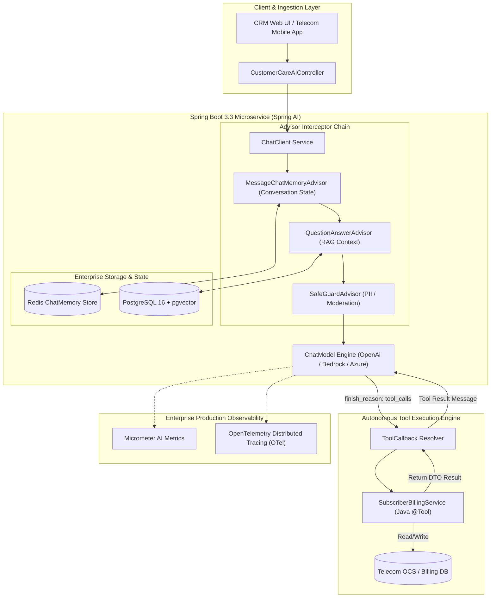

# 15. Spring AI Enterprise Integration: Senior Architecture Guide
> **Evidence warning:** Spring AI is a learning target, not production experience verified by the original resume. Pin the version before using any API example.
**Target Profile:** Senior Product Software Engineer / AI-Enabled Backend Engineer (Spring Boot 3.x, Spring AI 1.0+, ChatClient Fluent API, Advisors, Tool Calling, ChatMemory)  
**Author:** Siva Prasad Vajja  
**Domain Alignment:** Telecom CRM, Enterprise Microservices, Core Platform Architecture, Automated Customer Self-Service  

---

## 1. Definition
**Spring AI at the Senior Engineering Level** is the native, enterprise-grade framework from the Spring team that integrates generative AI foundations directly into modern Java/Spring Boot enterprise microservices. It abstracts disparate AI foundation models (OpenAI, Azure OpenAI, Anthropic Claude, AWS Bedrock, Mistral, Ollama) behind uniform, portable abstractions, adhering to established Spring design paradigms: Dependency Injection (DI), Inversion of Control (IoC), declarative client builders, Micrometer observability, and filter/interceptor chains.

Rather than treating AI as disconnected Python scripts or messy raw HTTP REST calls, Spring AI elevates AI interactions to first-class enterprise services through:
* The **`ChatClient` Fluent API**
* The **`Advisor` Interceptor Pipeline**
* Strongly-typed **Tool Calling / Function Invocation**
* Portable **`VectorStore`** abstractions
* Distributed **`ChatMemory`** management

---

## 2. Why It Exists
In production enterprise architectures (such as Telecom CRM, BSS, and enterprise SaaS):
1. **The Python/Java Architectural Bifurcation:** Writing backend microservices in Java while isolating AI logic in Python (LangChain/FastAPI) creates architectural bloat: duplicate deployment pipelines, cross-service network serialization latency, fractured observability, and team skillset fragmentation.
2. **Vendor Lock-In Protection:** Switching an enterprise carrier from Azure OpenAI to AWS Bedrock or an on-premise Ollama cluster usually demands rewriting hundreds of HTTP client integrations. Spring AI enables this transition by modifying a single dependency and configuration file without altering domain code.
3. **Enterprise Non-Functional Requirements (NFRs):** Generative AI calls must participate in corporate security contexts, trace propagation via OpenTelemetry/Micrometer, resilience circuit breakers via Resilience4j, and structured logging—capabilities native to the Spring Boot ecosystem.

---

## 3. Problem It Solves
* **Boilerplate REST Client Code:** Eliminates manual HTTP orchestration, authorization header injection, and Jackson schema mapping.
* **Statelessness vs. Conversational Context:** Solved by the `ChatMemory` abstraction and `MessageChatMemoryAdvisor`, which manage conversation history in Redis or PostgreSQL across distributed microservice instances.
* **Bridging Deterministic Java Code with Probabilistic AI:** Solved by **Tool Calling (`@Tool`)**, allowing the LLM to autonomously trigger Java methods (e.g., querying subscriber balance or activating roaming bundles).
* **Cross-Cutting AI Concerns:** Solved by **Advisors**, allowing rate limiting, PII masking, safety guardrails, and RAG retrieval to wrap LLM calls cleanly without polluting business logic.

---

## 4. Internal Working

### 4.1 The `ChatClient` Architecture & Lifecycle
`ChatClient` is built around a fluent, declarative builder pattern:

```
ChatClient.Builder -> RequestSpec -> Advisor Chain Execution -> ChatModel (RPC) -> ResponseSpec -> Strongly-Typed DTO
```

1. **Request Specification (`prompt()`):** Binds system prompts, user input, parameters (temperature, model name), and tool callbacks.
2. **Advisor Chain (`AroundAdvisor`):** Interceptors wrap the call. Pre-advisors mutate the prompt (e.g., pulling past messages from Redis); post-advisors mutate or audit the response.
3. **ChatModel RPC:** Dispatches the normalized payload to the underlying provider (e.g., `OpenAiChatModel`).
4. **Entity Extraction (`entity()`):** Uses Jackson and JSON Schema reflection to parse response tokens directly into immutable Java 17 `record`s.

### 4.2 The Advisor Pattern (AOP for Generative AI)
Spring AI's `CallAroundAdvisor` and `StreamAroundAdvisor` provide an interceptor chain analogous to Spring Security filters or Servlet filters:

```
[ Request In ] 
     |
     v
[ MessageChatMemoryAdvisor ]  ---> Injects conversation history from Redis
     |
     v
[ QuestionAnswerAdvisor ]     ---> Queries PgVectorStore and injects RAG context
     |
     v
[ CustomPIIMaskingAdvisor ]   ---> Masks credit cards & MSISDNs in user prompt
     |
     v
[ ChatModel.call() ]          ---> Network call to LLM Provider
     |
     v
[ TelemetryAdvisor ]          ---> Emits Micrometer metrics (tokens, latency)
     |
     v
[ Response Out ]
```

### 4.3 Automated Tool/Function Calling Loop
When tools are registered via `.tools(telecomToolBean)`:
1. Spring AI generates a JSON Schema representation of the Java method signature and parameter descriptions (`@ToolParam`).
2. The schema is sent to the LLM along with the user prompt.
3. If the LLM determines a tool is required, it halts text generation and returns a structured call:
   `finish_reason: tool_calls, function: { name: "getSubscriberBalance", args: {"msisdn": "9988776655"} }`.
4. Spring AI intercepts this response, invokes the registered Java `@Bean` method via reflection, captures the returned Java object, serializes it to JSON, and sends a follow-up request back to the model.
5. The model consumes the tool's output and synthesizes the final customer-facing response.

---

## 5. Architecture



---

## 6. Important Components

| Component | Class / Interface | Responsibility |
|---|---|---|
| **Chat Client Builder** | `ChatClient.Builder` | Fluent builder for configuring default system prompts, advisors, and models. |
| **Model Abstraction** | `ChatModel` | Low-level provider interface implemented by `OpenAiChatModel`, `BedrockChatModel`, etc. |
| **Advisor Chain** | `CallAroundAdvisor` | Interceptor interface for cross-cutting prompt/response modifications. |
| **Conversation Memory** | `ChatMemory` / `RedisChatMemory` | Stores conversation history per `conversationId` to provide multi-turn state. |
| **Vector Store** | `PgVectorStore` | Connects Spring AI to PostgreSQL for automated RAG retrieval via `QuestionAnswerAdvisor`. |
| **Tool Calling** | `@Tool` / `ToolCallback` | Annotation-driven mechanism to expose Java methods as callable tools to LLMs. |

---

## 7. Example: Tool Calling Annotation in Java
Exposing internal telecom microservice functions to the LLM:

```java
package com.sixdee.crm.ai.tools;

import org.springframework.ai.tool.annotation.Tool;
import org.springframework.ai.tool.annotation.ToolParam;
import org.springframework.stereotype.Component;

import java.math.BigDecimal;

@Component
public class TelecomCustomerServiceTools {

    @Tool(description = "Retrieve current account balance, currency, and active plan status for a given subscriber MSISDN")
    public AccountBalanceDetails getSubscriberBalance(
            @ToolParam(description = "The 10 or 12 digit subscriber phone number (MSISDN)") String msisdn) {
        // Invoking internal Telecom OCS / Billing service
        return new AccountBalanceDetails(msisdn, new BigDecimal("42.50"), "USD", "ACTIVE", "Unlimited 5G Postpaid");
    }

    @Tool(description = "Apply an authorized promotional roaming credit waiver to a subscriber account balance")
    public CreditWaiverResult applyRoamingWaiver(
            @ToolParam(description = "The subscriber MSISDN") String msisdn,
            @ToolParam(description = "Amount in USD to credit, maximum 25.00") BigDecimal amount,
            @ToolParam(description = "Internal ticket reason for waiver") String reason) {
        // Enforce business validation
        if (amount.compareTo(new BigDecimal("25.00")) > 0) {
            return new CreditWaiverResult(msisdn, false, "Waiver exceeds automated limit of $25.00. Requires supervisor approval.");
        }
        return new CreditWaiverResult(msisdn, true, "Waiver of $" + amount + " successfully applied under reason: " + reason);
    }

    public record AccountBalanceDetails(String msisdn, BigDecimal balance, String currency, String status, String planName) {}
    public record CreditWaiverResult(String msisdn, boolean success, String message) {}
}
```

---

## 8. Java/Spring Boot Example: Full Production Service

```java
package com.sixdee.crm.ai.service;

import com.sixdee.crm.ai.tools.TelecomCustomerServiceTools;
import org.slf4j.Logger;
import org.slf4j.LoggerFactory;
import org.springframework.ai.chat.client.ChatClient;
import org.springframework.ai.chat.client.advisor.MessageChatMemoryAdvisor;
import org.springframework.ai.chat.client.advisor.QuestionAnswerAdvisor;
import org.springframework.ai.chat.memory.ChatMemory;
import org.springframework.ai.vectorstore.VectorStore;
import org.springframework.stereotype.Service;

@Service
public class CustomerCareAssistantService {

    private static final Logger log = LoggerFactory.getLogger(CustomerCareAssistantService.class);

    private final ChatClient chatClient;

    public CustomerCareAssistantService(
            ChatClient.Builder chatClientBuilder,
            ChatMemory chatMemory,
            VectorStore vectorStore,
            TelecomCustomerServiceTools telecomTools) {

        this.chatClient = chatClientBuilder
            .defaultSystem("""
                You are the intelligent Customer Care Copilot for Telecom CRM.
                You assist customer care agents in resolving subscriber inquiries.
                You have access to tools for balance checks and approved credit adjustments.
                Always verify account status before proposing billing adjustments.
                Keep responses concise, professional, and clear.
                """)
            .defaultAdvisors(
                // 1. Maintain conversation history per conversationId
                new MessageChatMemoryAdvisor(chatMemory),
                // 2. Automatically retrieve relevant policy documents from PostgreSQL pgvector
                new QuestionAnswerAdvisor(vectorStore)
            )
            // 3. Register Java tools
            .defaultTools(telecomTools)
            .build();
    }

    public String handleAgentInteraction(String conversationId, String userMessage) {
        log.info("Processing conversation: {}, message: '{}'", conversationId, userMessage);

        return chatClient.prompt()
            .user(userMessage)
            .advisors(advisorSpec -> advisorSpec.param(MessageChatMemoryAdvisor.CHAT_MEMORY_CONVERSATION_ID_KEY, conversationId))
            .call()
            .content();
    }
}
```

---

## 9. Production Use Case: Telecom CRM Agent Copilot
In **6D Technologies CRM platforms**:
1. **The Workflow:** A customer calls complaining about an unexpected $18 charge while transiting through Frankfurt airport.
2. **The Execution via Spring AI:**
   - The agent types: *"Check account for 9845012345 and see if we can waive the $18 roaming fee."*
   - Spring AI's `QuestionAnswerAdvisor` pulls the carrier's **Roaming Goodwill Adjustment Policy** from `pgvector`.
   - The model observes that the policy permits a one-time waiver up to $20 for premier subscribers.
   - The model calls `getSubscriberBalance("9845012345")`, checks the status, and calls `applyRoamingWaiver("9845012345", 18.00, "Airport Transit Goodwill")`.
   - The model synthesizes an agent confirmation: *"The $18 roaming charge has been waived under the Goodwill Policy. Account balance updated to $24.50."*
3. **Result:** Resolves the entire billing dispute in 12 seconds with audit logs recorded in PostgreSQL.

---

## 10. Common Mistakes in Spring AI

| Anti-Pattern | Root Cause | Engineering Fix |
|---|---|---|
| **Rebuilding `ChatClient` per Request** | `chatClientBuilder.build()` inside every controller method call. | Initialize `ChatClient` once in `@Service` constructor or declare it as a `@Bean`. |
| **Missing Tool Parameter Docs** | Omitting `@ToolParam(description = "...")` on tool methods. | The LLM will pass incorrect or null arguments. Always document every parameter explicitly. |
| **Unbounded In-Memory `ChatMemory`** | Using default `InMemoryChatMemory` in clustered production. | Causes memory leaks and loses session state across load-balanced pods. Use `RedisChatMemory` or JDBC. |
| **Throwing Unhandled Exceptions in `@Tool`** | A tool throws `NullPointerException`, crashing the entire LLM loop. | Catch exceptions inside the tool and return a descriptive error string: `return "Error: Subscriber not found"`. |
| **Over-Stuffing Memory Window** | Retaining 100 conversation turns, exceeding LLM context windows. | Wrap memory in a sliding window (e.g., retain last 10 messages). |

---

## 11. Performance Considerations

### 11.1 Reactive Streaming (`Flux<String>`) for Real-Time UI
In web and mobile applications, waiting 3–5 seconds for a complete LLM completion causes high user drop-off. Spring AI provides reactive streaming via WebFlux:

```java
@GetMapping(value = "/stream", produces = MediaType.TEXT_EVENT_STREAM_VALUE)
public Flux<String> streamInteraction(@RequestParam String conversationId, @RequestParam String message) {
    return chatClient.prompt()
        .user(message)
        .advisors(spec -> spec.param(MessageChatMemoryAdvisor.CHAT_MEMORY_CONVERSATION_ID_KEY, conversationId))
        .stream()
        .content();
}
```
*Reduces Time To First Token (TTFT) perception to $< 300$ms.*

### 11.2 Distributed ChatMemory Sizing in Redis
When persisting multi-turn chat sessions in Redis:
* Store messages as serialized JSON strings under key `crm:chat:memory:{conversationId}`.
* Enforce an aggressive Time-To-Live (TTL) (e.g., `EXPIRE 3600` - 1 hour idle timeout).
* Bound history length via `new MessageChatMemoryAdvisor(chatMemory, conversationId, 10)` to prevent context window saturation.

---

## 12. Security Considerations: Tool Execution Guardrails

```
+-------------------------------------------------------------------------------+
|                        TOOL SECURITY GOVERNANCE                               |
+-------------------------------------------------------------------------------+
| 1. Read vs. Write Tool Classification (Separation of Concerns)                |
| 2. Parameter Range Clamping (e.g., max credit waiver = $25.00)                 |
| 3. Security Context Propagation (SecurityContextHolder into Tool Call thread) |
| 4. Human-in-the-Loop Confirmation for High-Impact Operations                  |
+-------------------------------------------------------------------------------+
```

* **Never allow an LLM tool to execute raw SQL or arbitrary shell commands.**
* **Enforce Spring Security context propagation:** If the calling user lacks the `ROLE_SUPERVISOR` authority, the `@Tool` method must throw an `AccessDeniedException` if a high-value waiver is attempted.

---

## 13. Core Interview Questions (With Senior Answers)

### Q1: What is the architectural purpose of Spring AI's `ChatClient`?
**Answer:** `ChatClient` is the fluent, high-level client abstraction in Spring AI. Analogous to `WebClient` or `RestClient`, it provides a declarative API to construct prompts, set system messages, bind tools, inject advisors, and deserialize LLM completions into domain objects. It completely abstracts away the low-level provider-specific JSON payloads and network mechanics of OpenAI, Bedrock, or Anthropic.

### Q2: How does the Spring AI Advisor architecture work?
**Answer:** The Advisor architecture is an implementation of the Interceptor / Decorator pattern (AOP) for AI workflows. An Advisor implements `CallAroundAdvisor` or `StreamAroundAdvisor`. When a prompt is dispatched, the request travels through a pipeline of advisors (such as `MessageChatMemoryAdvisor` for injecting chat history and `QuestionAnswerAdvisor` for vector RAG retrieval) before reaching the `ChatModel`. The response flows back through the same pipeline, allowing cross-cutting concerns like telemetry, PII masking, and logging to be applied cleanly.

### Q3: How does Spring AI handle Tool Calling under the hood?
**Answer:** When Java methods annotated with `@Tool` are bound to a `ChatClient`, Spring AI reflects over their signatures and parameter annotations (`@ToolParam`) to construct a JSON Schema defining the tools. This schema is transmitted in the API request. If the LLM responds with `finish_reason: tool_calls`, Spring AI's runtime automatically resolves the bean, invokes the method with the model's parsed JSON arguments, and sends the tool's return value back to the model in a follow-up request. This cycle repeats until the model produces a final natural language or structured response.

### Q4: Why should you avoid `InMemoryChatMemory` in production?
**Answer:** `InMemoryChatMemory` stores chat history in a local JVM `ConcurrentHashMap`. In a cloud-native Kubernetes environment:
1. Pod restarts or crashes wipe all conversation state.
2. Load balancers route subsequent customer requests to different pod replicas, causing the assistant to lose conversational context.
3. It creates unmanaged heap growth, eventually triggering an `OutOfMemoryError`. Production environments must use distributed stores like `RedisChatMemory` or PostgreSQL-backed chat memory.

---

## 14. Deep Architectural Interview Questions (Senior/Staff Level)

### Q1: How do you achieve end-to-end distributed tracing across LLM calls and tool executions in Spring Boot?
**Answer:**  
"Spring AI provides native instrumentation for **Micrometer Tracing** and **OpenTelemetry**.  
When a user request hits the API Gateway, a W3C `traceparent` header is initiated. Spring AI automatically instruments the `ChatModel` to create spans:
- `gen_ai.client.operation`: Spans the duration of the external LLM network call, capturing prompt token counts, completion token counts, and model metadata as OpenTelemetry span attributes.
- When the model initiates a tool call, Spring AI invokes the registered Java method within a child span: `gen_ai.client.tool.execution`.  
This ensures that in Grafana Tempo or Zipkin, an engineer can inspect the exact waterfall: Gateway $\to$ Spring AI Controller $\to$ LLM Prefill $\to$ Tool DB Query $\to$ Final Synthesis, correlating database latency and LLM inference latency under a single Trace ID."

### Q2: How do you implement dynamic model routing and fallback across providers (e.g., Azure OpenAI to AWS Bedrock)?
**Answer:**  
"We achieve model portability and failover by combining Spring AI's `ChatModel` interface with Resilience4j:
1. **Multi-Model Beans:** We declare two distinct `ChatModel` beans in the Spring configuration: `@Qualifier("primaryAzureModel")` and `@Qualifier("fallbackBedrockModel")`.
2. **Resilience4j Circuit Breaker:** We wrap the primary model execution in a `@CircuitBreaker(name = "llmProvider", fallbackMethod = "routeToBedrock")`.
3. **Automatic Failover:** If Azure OpenAI encounters HTTP 429 rate limits, HTTP 503 service outages, or consecutive connection timeouts, the circuit trips. The `routeToBedrock` fallback method seamlessly dispatches the exact same Spring AI `Prompt` object to the AWS Bedrock `ChatModel`. Because Spring AI normalizes prompt structures across providers, no prompt translation code is required."

---

## 15. Comparison with Alternatives

| Feature | Spring AI (Java) | LangChain4j (Java) | LangChain (Python) | Raw `RestClient` (Java) |
|---|---|---|---|---|
| **Ecosystem Fit** | Native Spring Boot 3.x | Independent Java library | Python ecosystem | Native Java |
| **Design Paradigm** | Spring Builders, Advisors, Starters | Fluent Builders | Pythonic chains / DAGs | Manual HTTP orchestration |
| **Observability** | Native Micrometer / OTel | OpenTelemetry plugin | LangSmith (Proprietary) | Manual logging |
| **Tool Calling** | Annotation-driven (`@Tool`) | Annotation-driven (`@Tool`) | Decorators (`@tool`) | Manual JSON parsing |
| **GraalVM Native** | Fully supported | Supported | N/A | Supported |
| **Production Maturity** | High (Backed by Pivotal/VMware) | High (Active community) | High | Low (Fragile maintenance) |

---

## 16. When NOT to Use Spring AI
1. **Non-Spring Applications:** If building lightweight CLI tools, Quarkus, or Micronaut applications, use **LangChain4j**, which does not require the Spring application context.
2. **Pure Data Science & Offline Model Fine-Tuning:** Pre-training, LoRA fine-tuning, or high-throughput batch dataset manipulation belongs in Python (PyTorch, Hugging Face, Ray). Spring AI is an application integration framework, not a model training framework.
3. **Ultra-Minimalist Micro-Services (< 30MB Memory Target):** If running on extreme edge IoT hardware where the JVM footprint is restricted, use a lightweight C++ or Rust LLM runtime (e.g., `llama.cpp`).

---

## 17. Hands-On Exercise: Unit Testing ChatClient with MockChatModel

```java
package com.sixdee.crm.ai.service;

import org.junit.jupiter.api.DisplayName;
import org.junit.jupiter.api.Test;
import org.springframework.ai.chat.client.ChatClient;
import org.springframework.ai.chat.model.ChatModel;
import org.springframework.ai.chat.model.ChatResponse;
import org.springframework.ai.chat.model.Generation;
import org.springframework.ai.chat.prompt.Prompt;

import static org.assertj.core.api.Assertions.assertThat;
import static org.mockito.ArgumentMatchers.any;
import static org.mockito.Mockito.mock;
import static org.mockito.Mockito.when;

class CustomerCareAssistantServiceTest {

    @Test
    @DisplayName("Should invoke ChatClient and return model response without network call")
    void testChatClientExecution() {
        ChatModel mockChatModel = mock(ChatModel.class);
        Generation mockGeneration = new Generation("The subscriber account has an active balance of $42.50.");
        ChatResponse mockResponse = new ChatResponse(java.util.List.of(mockGeneration));

        when(mockChatModel.call(any(Prompt.class))).thenReturn(mockResponse);

        ChatClient chatClient = ChatClient.builder(mockChatModel).build();
        String response = chatClient.prompt().user("What is the balance for MSISDN 9988776655?").call().content();

        assertThat(response).contains("$42.50");
    }
}
```

---

## 18. Project Application: Telecom CRM Core Platform
Illustrative Spring AI project application (not current 6D production evidence):
* **Modernizing the Customer Interaction Engine:**
  - Replace legacy procedural Java helper classes with Spring AI's `ChatClient`.
  - Equip the CRM agent desktop with an embedded conversational assistant capable of invoking billing APIs, subscriber SIM status lookups, and plan upgrade workflows via `@Tool` annotations.
  - Implement `RedisChatMemory` to support continuous multi-turn dialogue across customer care calls without state fragmentation.

---

## 19. Senior-Level Interview Answer (The "Gold Standard")

> *"In enterprise Java organizations, Spring AI is the premier architectural foundation for integrating Generative AI. It eliminates the fragile practice of deploying parallel Python microservices by bringing LLMs natively into the Spring Boot 3 ecosystem.  
>  
> *Rather than managing raw HTTP client code or provider-specific SDKs, we build upon Spring AI's `ChatClient` fluent API. We exploit the `Advisor` architecture to cleanly decouple cross-cutting concerns—such as distributed conversation state via `MessageChatMemoryAdvisor` and automated knowledge base retrieval via `QuestionAnswerAdvisor`—from core business logic.  
>  
> *For operational workflows, we expose internal domain services to the model using strongly-typed `@Tool` annotations, allowing the model to perform autonomous data retrieval while enforcing strict business validation, parameter bounds, and Spring Security authority checks in Java before any financial action is executed."*

---

## 20. Real-World Troubleshooting Scenarios

### Scenario A: Infinite Tool-Calling Loop in Production
* **Symptom:** The LLM gets trapped calling the same tool repeatedly (e.g., `getSubscriberBalance`), driving up token consumption until a timeout occurs.
* **Root Cause:** The tool returned an error or null payload that failed to satisfy the model's objective, and the system prompt lacked termination instructions.
* **Fix:**
  1. Configure `maxToolCalls` limit on the client builder to terminate after 3 iterations.
  2. Improve tool error reporting: Return explicit guidance: `return "Subscriber balance is unavailable. Do not retry this tool; inform the customer."`

### Scenario B: Concurrent User Chat Cross-Talk (State Pollution)
* **Symptom:** User A asks a question and receives an answer containing User B's account details and conversation history.
* **Root Cause:** The developer hardcoded a static `conversationId` or reused the same `ChatClient` advisor instance across multiple concurrent HTTP request threads without passing the dynamic `conversationId` in the execution parameters.
* **Fix:** Pass the `conversationId` dynamically in the execution parameter map for every request:
  ```java
  .advisors(spec -> spec.param(MessageChatMemoryAdvisor.CHAT_MEMORY_CONVERSATION_ID_KEY, userSessionId))
  ```

### Scenario C: OutOfMemoryError in Redis Cluster from Leaking Chat Sessions
* **Symptom:** Redis cluster memory usage climbed continuously over 30 days until reaching eviction threshold.
* **Root Cause:** `RedisChatMemory` keys were created without an expiration TTL. Stale conversations from inactive users persisted indefinitely.
* **Fix:** Configure a custom Redis key expiration policy or inject a cleanup job that executes `EXPIRE` on conversation keys with a 24-hour sliding TTL upon every message write.
