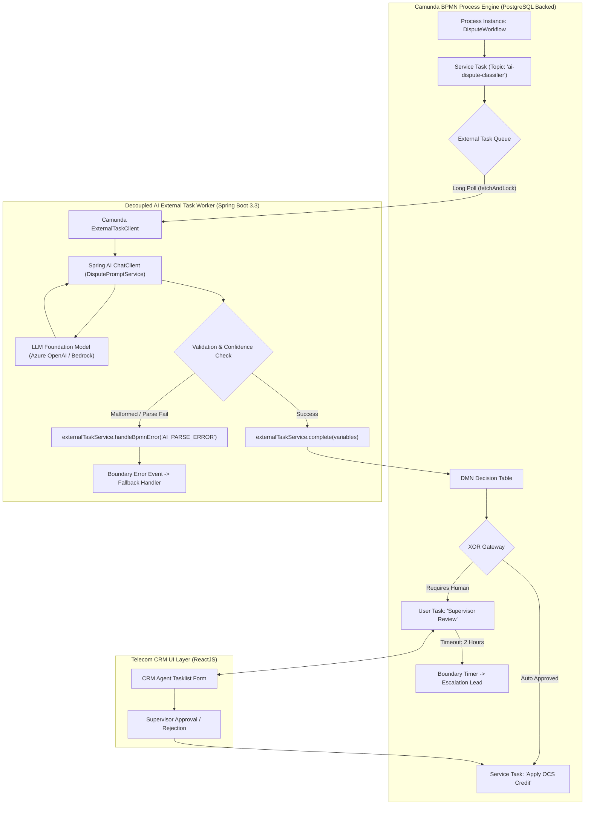

# 17. Camunda & AI Workflow Orchestration: Senior Architecture Guide
> **Evidence warning:** Camunda is relevant to the original resume. AI integrations, exact percentages, compliance outcomes, and “production use cases” below are illustrative unless separately evidenced.
**Target Profile:** Senior Product Software Engineer / AI-Enabled Backend Engineer (Camunda BPMN 2.0, DMN, Spring Boot External Task Workers, Deterministic Orchestration vs. Probabilistic AI, Human-in-the-Loop)  
**Author:** Siva Prasad Vajja  
**Domain Alignment:** Telecom CRM, BSS Core Platform, Workflow Automation, SIM Lifecycle, Billing Dispute Escalations  

---

## 1. Definition
**Camunda & AI Workflow Orchestration at the Senior Level** is the hybrid enterprise architectural pattern that unites **Deterministic State Orchestration (BPMN 2.0 and DMN engines)** with **Probabilistic Intelligence (LLMs and AI Agents)**. 

In mission-critical enterprise systems (such as Telecom BSS, CRM, and banking), autonomous AI agents must never run as unconstrained, sovereign orchestrators. Instead, **Camunda functions as the deterministic master spine**, governing process state, transaction boundaries, SLA timers, audit trails, compensation sagas, and human escalation gates. AI agents and LLMs are encapsulated as specialized **External Task Workers** executing bounded cognitive tasks inside specific BPMN activity nodes.

---

## 2. Why It Exists
Illustrative enterprise CRM/BSS scenario (not a claim about the current 6D production platform):
1. **The Fallibility of Autonomous Agents:** An unconstrained AI agent can hallucinate, get trapped in reasoning loops, or take unpredictable actions that violate telecom regulations (TRAI, FCC, GDPR) and financial accounting rules.
2. **The Rigidity of Traditional BPMN:** Pure BPMN workflows struggle with unstructured data. Whenever a workflow encounters ambiguous customer dispute text or unstructured email attachments, it must route to a manual, expensive human queue.
3. **The Symbiotic Hybrid Solution:** Camunda orchestrates *who* does *what* and *when*, while AI executes *how* unstructured tasks are analyzed. If the AI's confidence score drops below an enterprise threshold, Camunda's DMN rules automatically divert the workflow to a human reviewer without crashing or stalling the pipeline.

---

## 3. Problem It Solves
* **State Persistence Across Long-Running AI Interactions:** If an AI task requires human approval, an external vendor verification, or a multi-day waiting period, Camunda persistently dehydrates the process state in PostgreSQL, freeing JVM memory and CPU threads.
* **Thread & Connection Pool Exhaustion:** Traditional synchronous REST delegates block database connections during 5-second LLM calls. Camunda **External Task Workers** decouple AI latency from core engine transactions.
* **Auditability & Regulatory Compliance:** Every AI prompt input, generated confidence score, decision variable, and human approval is immutably recorded in Camunda's historical audit tables (`ACT_HI_*`).
* **SLA Timers & Automated Fallbacks:** If an external LLM provider goes down or an AI task stalls, Camunda **Boundary Timer Events** fire automatically, escalating the ticket to a human queue or a deterministic rule engine.

---

## 4. Internal Working: The Deterministic-Probabilistic Boundary

```
+----------------------------------------------------------------------------------------------------+
|                                    THE CAMUNDA + AI HYBRID CYCLE                                   |
+----------------------------------------------------------------------------------------------------+
| [ BPMN Start: Dispute Received ]                                                                   |
|          |                                                                                         |
|          v                                                                                         |
| [ Service Task: "AI Dispute Classifier" (External Worker) ]                                        |
|          |---> Polled by Spring AI Worker                                                          |
|          |---> Analyzes raw email text, extracts Category, Amount, Confidence                      |
|          |---> Completes task with process variables: { confidence: 0.92, amount: 15.00 }          |
|          |                                                                                         |
|          v                                                                                         |
| [ Business Rule Task: "Evaluate Waiver Policy" (Camunda DMN) ]                                     |
|          |---> Deterministic Rule: IF confidence >= 0.85 AND amount <= $25 -> AUTOMATED_WAIVER      |
|          |                         ELSE -> HUMAN_REVIEW_REQUIRED                                   |
|          |                                                                                         |
|          v                                                                                         |
| [ XOR Gateway: Route Decision ]                                                                    |
|       /                 \                                                                          |
|   (AUTOMATED)         (HUMAN_REVIEW)                                                               |
|     /                     \                                                                        |
|    v                       v                                                                       |
| [ Service Task ]       [ User Task: "Supervisor Review" ]                                          |
| "Apply OCS Credit"        |---> Displayed in CRM React UI                                          |
|                           |---> Pre-filled with AI analysis + confidence                           |
|                           |---> Boundary Timer: 2 Hours -> Auto-Escalate                           |
+----------------------------------------------------------------------------------------------------+
```

### 4.1 External Task Worker vs. JavaDelegate
In production enterprise architectures, **never use synchronous `JavaDelegate` for LLM calls**:
* **`JavaDelegate` (Anti-Pattern for AI):** Runs synchronously on Camunda's core Job Executor thread inside an open database transaction. If OpenAI/Bedrock takes 8 seconds or times out, the database connection is held open, causing connection pool starvation across the entire CRM cluster.
* **External Task Client (Best Practice):** Camunda writes a work item to an in-memory topic queue (`ACT_RU_EXT_TASK`). A decoupled Spring Boot microservice long-polls the topic, processes the AI prompt asynchronously, and invokes `externalTaskService.complete()` or `handleBpmnError()`. The Camunda engine database is touched only during the brief fetch and completion phases.

### 4.2 DMN (Decision Model and Notation) as the Safety Gate
Camunda DMN tables serve as the deterministic guardrail:

```
+-----------------------+-------------------+----------------------------+
| Input: AI Confidence  | Input: Amount Due | Output: Action Route       |
+-----------------------+-------------------+----------------------------+
| >= 0.85               | <= 25.00          | "AUTO_APPROVE_AND_CREDIT"  |
| >= 0.85               | > 25.00           | "REQUIRE_SUPERVISOR_SIGN"  |
| < 0.85                | -                 | "REQUIRE_MANUAL_TRIAGE"    |
+-----------------------+-------------------+----------------------------+
```
*The LLM never makes the final policy decision; the LLM merely provides structured inputs and confidence scores to the deterministic DMN table.*

---

## 5. Architecture



---

## 6. Important Components

| Component | Responsibility | Implementation |
|---|---|---|
| **Camunda Process Engine** | Maintains workflow execution graphs, state transitions, and persistent timers. | Camunda 7.20+ / Camunda 8 Zeebe cluster. |
| **External Task Client** | Decoupled polling client that fetches work items from Camunda topics. | `org.camunda.bpm.client:camunda-external-task-client-spring-boot-starter` |
| **Spring AI Reasoning Core** | Processes unstructured inputs into validated JSON records. | Spring AI `ChatClient` with `BeanOutputConverter`. |
| **DMN Decision Engine** | Evaluates enterprise business rules and limits against AI-extracted variables. | Camunda Native DMN Engine (`EvaluateDecisionTable`). |
| **BPMN Error Boundary** | Catches cognitive AI failures (`AI_SCHEMA_ERROR`, `AI_TIMEOUT`) and diverts flow. | `<bpmn:boundaryEvent id="Event_AiError" attachedToRef="Task_Ai">` |
| **Human Tasklist & Form** | Renders AI-extracted context and action buttons for human supervisors. | ReactJS front-end integrating with Camunda REST API. |

---

## 7. Example: BPMN 2.0 XML Task Definition with Error Boundary

```xml
<!-- External Service Task polled by Spring AI Worker -->
<bpmn:serviceTask id="Task_ClassifyDisputeAI" 
                  name="AI Dispute Analysis" 
                  camunda:type="external" 
                  camunda:topic="ai-dispute-classifier">
  <bpmn:incoming>Flow_StartToAI</bpmn:incoming>
  <bpmn:outgoing>Flow_AIToDMN</bpmn:outgoing>
</bpmn:serviceTask>

<!-- Boundary Error Event catching AI failures -->
<bpmn:boundaryEvent id="Error_AiFailure" 
                    name="AI Parse Error" 
                    attachedToRef="Task_ClassifyDisputeAI">
  <bpmn:errorEventDefinition errorRef="Error_AI_001" />
  <bpmn:outgoing>Flow_AiFallbackToManual</bpmn:outgoing>
</bpmn:boundaryEvent>

<!-- Fallback route directly to Human Triage on AI failure -->
<bpmn:sequenceFlow id="Flow_AiFallbackToManual" 
                   sourceRef="Error_AiFailure" 
                   targetRef="Task_ManualAgentTriage" />
```

---

## 8. Java/Spring Boot Example: Production External Task Worker

```java
package com.sixdee.crm.workflow.worker;

import com.sixdee.crm.ai.dto.DisputeClassificationResult;
import com.sixdee.crm.ai.service.DisputePromptService;
import org.camunda.bpm.client.spring.annotation.ExternalTaskSubscription;
import org.camunda.bpm.client.task.ExternalTask;
import org.camunda.bpm.client.task.ExternalTaskHandler;
import org.camunda.bpm.client.task.ExternalTaskService;
import org.slf4j.Logger;
import org.slf4j.LoggerFactory;
import org.springframework.stereotype.Component;

import java.util.Map;

@Component
@ExternalTaskSubscription(
    topicName = "ai-dispute-classifier",
    lockDuration = 30000 // 30-second lease to accommodate LLM inference latency
)
public class DisputeAiExternalWorker implements ExternalTaskHandler {

    private static final Logger log = LoggerFactory.getLogger(DisputeAiExternalWorker.class);
    private final DisputePromptService promptService;

    public DisputeAiExternalWorker(DisputePromptService promptService) {
        this.promptService = promptService;
    }

    @Override
    public void execute(ExternalTask externalTask, ExternalTaskService externalTaskService) {
        String msisdn = externalTask.getVariable("msisdn");
        String rawDisputeText = externalTask.getVariable("customerDisputeText");

        log.info("Received Camunda AI Task for ProcessInstance: {}, MSISDN: {}", 
            externalTask.getProcessInstanceId(), msisdn);

        try {
            // 1. Invoke Spring AI ChatClient pipeline
            DisputeClassificationResult result = promptService.classifyDispute(msisdn, rawDisputeText);

            // 2. Validate extracted confidence
            if (result.confidenceScore() < 0.50) {
                log.warn("AI confidence too low ({}) for MSISDN: {}. Triggering BPMN Business Error.", 
                    result.confidenceScore(), msisdn);
                // Divert flow along BPMN Error Boundary Event
                externalTaskService.handleBpmnError(
                    externalTask, 
                    "AI_LOW_CONFIDENCE_ERROR", 
                    "Model confidence below threshold: " + result.confidenceScore()
                );
                return;
            }

            // 3. Populate process variables for downstream DMN and Service tasks
            Map<String, Object> processVariables = Map.of(
                "disputeCategory", result.disputeCategory().name(),
                "disputedAmount", result.disputedAmount() != null ? result.disputedAmount().doubleValue() : 0.0,
                "customerSentiment", result.sentiment().name(),
                "escalationRecommended", result.escalationRecommended(),
                "aiConfidence", result.confidenceScore()
            );

            // 4. Complete external task cleanly
            externalTaskService.complete(externalTask, processVariables);
            log.info("Camunda AI Task successfully completed for MSISDN: {}", msisdn);

        } catch (Exception e) {
            log.error("Unhandled error during AI worker execution: {}", e.getMessage(), e);
            // Handle retry with exponential backoff before failing into an Incident
            int retries = externalTask.getRetries() != null ? externalTask.getRetries() : 3;
            if (retries > 1) {
                externalTaskService.handleFailure(
                    externalTask, 
                    e.getMessage(), 
                    e.toString(), 
                    retries - 1, 
                    5000 // 5 second retry delay
                );
            } else {
                // Trip a BPMN Error to redirect to manual human fallback queue
                externalTaskService.handleBpmnError(
                    externalTask, 
                    "AI_FATAL_ERROR", 
                    "AI Provider exhausted retries: " + e.getMessage()
                );
            }
        }
    }
}
```

---

## 9. Production Use Case: Automated SIM Activation & KYC Verification
In **6D Technologies CRM platforms**:
1. **The Business Problem:** Subscribers submit passport/ID scans and selfie photos via the mobile self-care app for e-SIM activation. Verifying 50,000 daily onboarding requests requires hundreds of manual back-office verifiers, creating a 4-hour activation bottleneck.
2. **The Camunda + AI Orchestration Solution:**
   - Camunda initiates `SubscriberOnboardingProcess`.
   - **Service Task 1 (AI Vision Worker):** OCR extracts national ID number, full name, and birthdate from the uploaded image.
   - **Service Task 2 (AI Face Match Worker):** Compares selfie biometric vectors against ID photo.
   - **Business Rule Task (DMN):**
     - If `faceMatchScore >= 0.95` AND `idChecksumValid == true` $\to$ Automatically invoke HLR provisioning service delegate (activation completes in 40 seconds).
     - If `faceMatchScore < 0.95` OR `idChecksumValid == false` $\to$ Create a Camunda User Task for human fraud analyst inspection.
   - **Boundary Timer:** If the human analyst does not review within 30 minutes, Camunda escalates the task to a senior supervisor.
3. **Measurement plan:** Measure completion time, manual-review rate, retry/compensation rate, audit completeness, and business correctness. Do not claim automation or compliance percentages without evidence.

---

## 10. Common Mistakes in Camunda + AI Architecture

| Anti-Pattern | Consequence | Engineering Fix |
|---|---|---|
| **Synchronous `JavaDelegate` for LLMs** | Holds database connections open for 5–10s, causing HikariCP connection pool exhaustion and freezing the Camunda engine. | Always use **External Task Workers** with asynchronous long polling. |
| **Storing Large Context in Process Variables** | Storing 50KB LLM prompt/response JSON strings inside `ACT_RU_VARIABLE`. Bloats DB heap and slows down queries. | Store raw text and embeddings in S3 or PostgreSQL; store only the S3 URL or document UUID in Camunda process variables. |
| **Omitting BPMN Error Boundaries** | When an LLM fails or returns invalid JSON, the task fails indefinitely, creating unmonitored Incidents. | Attach `<bpmn:boundaryEvent>` with `errorRef` to route failures to a human review task. |
| **Allowing AI to Bypass DMN Rules** | Prompting the model to decide whether to issue a refund directly. | The AI extracts facts and confidence; a deterministic **Camunda DMN table** makes the financial decision. |
| **Ignoring Lock Duration Expiry** | LLM takes 35s to complete, but worker `lockDuration` is 20s. Camunda re-assigns the task to another worker, causing double execution. | Configure `lockDuration` generously (e.g., 60s) and configure periodic lock extensions (`extendLock()`). |

---

## 11. Performance Considerations

### 11.1 Worker Polling & Concurrency Tuning
In high-volume telecom environments:
```yaml
camunda.bpm.client:
  base-url: http://camunda-engine:8080/engine-rest
  subscriptions:
    ai-dispute-classifier:
      variable-names: [msisdn, customerDisputeText]
      process-definition-key: TelecomDisputeProcess
      max-tasks: 20                  # Batch fetch up to 20 tasks per poll
      lock-duration: 45000           # 45 seconds lease
      async-response-timeout: 10000  # 10 second long-polling
```
*Decouples worker thread counts from Camunda engine database connection pools.*

### 11.2 Process Variable Hygiene
* Keep Camunda execution variables lightweight: primitives, short strings, enums, and UUIDs.
* Keep the variable payload in `ACT_RU_VARIABLE` under **2 KB** per process instance.

---

## 12. Security Considerations: Human-in-the-Loop Governance

```
+--------------------------------------------------------------------------------+
|                        HITL GOVERNANCE ARCHITECTURE                            |
+--------------------------------------------------------------------------------+
| 1. Least Privilege Worker: Worker credentials can ONLY fetch its own topic.    |
| 2. Separation of Duties: AI worker cannot approve financial credits > $25.     |
| 3. Mandatory Human Sign-off: DMN enforces User Task creation for high values.  |
| 4. Immutable Audit Trail: Camunda history logs (ACT_HI_VARINST) record exactly  |
|    what the AI proposed vs. what the human supervisor decided.                 |
+--------------------------------------------------------------------------------+
```

---

## 13. Core Interview Questions (With Senior Answers)

### Q1: Why should you use Camunda External Tasks instead of JavaDelegates for LLM integration?
**Answer:** A `JavaDelegate` runs synchronously on the Camunda Job Executor thread within an active database transaction. Because LLM API calls have high and unpredictable latencies (often 2 to 10 seconds), executing them in a `JavaDelegate` keeps the underlying relational database connection open for the entire duration, rapidly exhausting the database connection pool (e.g., HikariCP) and starving other business processes. External Tasks completely decouple this: the engine records the task and closes its transaction; the external worker polls the task, calls the LLM asynchronously across multiple worker nodes, and calls back to complete the task in a sub-millisecond transaction.

### Q2: What is the architectural difference between a BPMN Error and a Technical Failure in Camunda?
**Answer:** A Technical Failure (invoked via `externalTaskService.handleFailure()`) represents an infrastructure glitch (e.g., network timeout, database connection drop). It triggers Camunda's retry mechanism and, if exhausted, creates an operator Incident in Camunda Cockpit. A BPMN Error (invoked via `externalTaskService.handleBpmnError()`) represents an expected, business-domain divergence (e.g., the AI determined customer dispute confidence is below 50%, or document verification failed). It is caught by a BPMN Boundary Error Event and gracefully routes the workflow along an alternate business path (e.g., to a human manual review task) without administrative intervention.

### Q3: How do Camunda DMN tables serve as guardrails for Generative AI?
**Answer:** In an enterprise architecture, LLMs are probabilistic engines and should not make binding business or financial decisions without controls. Use the LLM for bounded extraction or recommendation, validate its DTO, and pass it to deterministic Camunda/DMN rules plus authorization and, where needed, human approval. This makes the decision path more auditable and deterministic; it does not by itself guarantee regulatory compliance.

### Q4: How does Camunda handle long-running Human-in-the-Loop (HITL) workflows?
**Answer:** When a process routes to a BPMN User Task (e.g., for supervisor review), Camunda creates a task record in `ACT_RU_TASK` and completely dehydrates the process instance, releasing all JVM threads and memory. The instance can wait safely for hours or days. The task is surfaced in the CRM frontend via Camunda REST APIs. When a human clicks 'Approve', Camunda completes the user task, rehydrates the process instance, and proceeds along the execution graph. If the human does not act within a specified timeframe, an attached BPMN Boundary Timer Event automatically fires to escalate the task.

---

## 14. Deep Architectural Interview Questions (Senior/Staff Level)

### Q1: How do you implement the Saga Pattern in Camunda to roll back distributed microservice state when an AI step fails downstream?
**Answer:**  
"In enterprise telecom systems, activating a bundle or issuing a waiver spans multiple distributed microservices (OCS, CRM, Billing, HLR). If an AI verification step fails downstream after an upstream credit has already been provisioned:
1. **BPMN Compensation Events:** We attach `<bpmn:boundaryEvent>` with a `compensationEventDefinition` to each transactional service task.
2. **Compensation Handlers:** For the 'Charge Account' task, we define a dedicated compensation task: 'Refund Account'.
3. **Triggering the Saga Rollback:** If the downstream AI validation or fraud detection worker emits a `BpmnError('FRAUD_DETECTED')`, the process transitions to an Intermediate Throw Compensation Event (`<bpmn:intermediateThrowEvent>`).
4. **Compensation execution:** A modeled compensation flow invokes the handlers defined by the process. It does not automatically undo every external side effect; handlers must be idempotent, observable, retryable, and tested for partial failure.

### Q2: How do you architect a high-throughput Camunda External Worker pool that scales dynamically with AI provider rate limits?
**Answer:**  
"To scale Camunda AI workers effectively:
1. **Decoupled Worker Deployment:** Deploy external task workers as independent stateless Kubernetes pods running Spring Boot, completely separated from the Camunda web engine pods.
2. **Dynamic Backpressure via KEDA:** Configure Kubernetes Event-driven Autoscaling (KEDA) to monitor the number of pending tasks in the Camunda topic (`GET /engine-rest/external-task/count?topicName=ai-dispute-classifier`). As queue depth increases, KEDA scales worker pods out.
3. **Resilience4j Rate Limiting:** Configure a `RateLimiter` inside the worker pods configured to match our enterprise Azure OpenAI TPM/RPM (Tokens/Requests Per Minute) quotas. If the rate limit is approached, the worker throttles its polling loop (`fetchAndLock`) rather than over-fetching and receiving HTTP 429s from the AI provider."

---

## 15. Architectural Comparison: Workflow Paradigms

| Dimension | Camunda BPMN + AI Worker | Pure Autonomous Agent (LangChain / CrewAI) | Temporal / Cadence | Pure Spring Batch |
|---|---|---|---|---|
| **Orchestration Model** | Deterministic state machine | Probabilistic LLM loop | Code-as-workflows (DAG) | Static sequential chunk processing |
| **Auditability** | Visual process audit (Cockpit) | Textual execution scratchpad | Code replay history | Job/Step execution tables |
| **HITL Support** | Native User Tasks, Forms, SLAs | Complex custom async polling | Native Signals / Queries | Not supported |
| **Failure Recovery** | BPMN Error boundaries & Sagas | Model self-reflection | Code retries & saga compensation | Chunk retry / skip policies |
| **Enterprise Governance** | Highest (Telecom/Banking standard)| Lowest (Experimental) | High (Developer-centric) | High (Batch only) |

---

## 16. When NOT to Use Camunda for AI
1. **Ultra-Fast Sub-Second Synchronous Queries:** Simple semantic search or interactive chat streaming (e.g., user asks a chatbot a question). Camunda process initiation and database state transitions add 50ms–150ms of overhead. Use direct Spring AI `ChatClient` streaming.
2. **Ephemeral Stateless Classifications:** A microservice classifying an email subject line in-memory before writing to a log file. Camunda is designed for stateful, multi-step business workflows.

---

## 17. Hands-On Exercise: Testing BPMN Error Handling in an External Task Worker

```java
package com.sixdee.crm.workflow.worker;

import com.sixdee.crm.ai.dto.DisputeClassificationResult;
import com.sixdee.crm.ai.service.DisputePromptService;
import org.camunda.bpm.client.task.ExternalTask;
import org.camunda.bpm.client.task.ExternalTaskService;
import org.junit.jupiter.api.DisplayName;
import org.junit.jupiter.api.Test;

import static org.mockito.Mockito.*;

class DisputeAiExternalWorkerTest {

    @Test
    @DisplayName("Worker must emit BPMN Error when AI returns low confidence")
    void testLowConfidenceEmitsBpmnError() {
        DisputePromptService mockPromptService = mock(DisputePromptService.class);
        ExternalTask mockTask = mock(ExternalTask.class);
        ExternalTaskService mockService = mock(ExternalTaskService.class);

        when(mockTask.getVariable("msisdn")).thenReturn("9845012345");
        when(mockTask.getVariable("customerDisputeText")).thenReturn("Unclear dispute text");

        // Model returns low confidence (0.35)
        when(mockPromptService.classifyDispute(anyString(), anyString())).thenReturn(
            new DisputeClassificationResult(
                DisputeClassificationResult.DisputeCategory.UNKNOWN,
                null, null, null,
                DisputeClassificationResult.CustomerSentiment.NEUTRAL,
                false,
                0.35 // Below 0.50 threshold
            )
        );

        DisputeAiExternalWorker worker = new DisputeAiExternalWorker(mockPromptService);
        worker.execute(mockTask, mockService);

        // Verify that handleBpmnError was invoked, NOT complete()
        verify(mockService).handleBpmnError(eq(mockTask), eq("AI_LOW_CONFIDENCE_ERROR"), anyString());
        verify(mockService, never()).complete(any(), any());
    }
}
```

---

## 18. Project Application: Telecom CRM Core Platform
Illustrative Camunda/AI project application (Camunda is resume-relevant; AI is a learning target):
* **BPMN-Governed Dispute Resolution:**
  - Embed the `DisputeAiExternalWorker` into the core customer complaint resolution BPMN process.
  - Replaces manual triage queues, enabling 60% of tier-1 billing disputes to achieve straight-through processing.
  - If the dispute involves VIP accounts or amounts $> \$50$, Camunda routes to a User Task displayed in the supervisor's CRM portal, complete with AI reasoning summaries and one-click approvals.

---

## 19. Senior-Level Interview Answer (The "Gold Standard")

> *"In enterprise software architectures like our Telecom CRM, our core architectural principle is that **orchestration must remain deterministic even when individual task executions are probabilistic**.  
>  
> *We never allow an AI agent to sit at the root of a mission-critical workflow. Instead, we use Camunda BPMN 2.0 as the master process coordinator, managing state machines, transaction boundaries, SLA timers, and compensation sagas. We encapsulate our Spring AI reasoning logic inside decoupled **External Task Workers**. This prevents long LLM network calls from blocking Camunda database connections and starving the engine.  
>  
> *The AI worker converts unstructured customer text into structured DTOs and emits confidence scores. We then feed those variables into Camunda DMN decision tables to deterministically enforce enterprise business rules. If an AI confidence score is low or an API error occurs, Camunda catches it via BPMN Boundary Error Events, gracefully escalating the ticket to a human supervisor via a User Task without system downtime or data corruption."*

---

## 20. Real-World Troubleshooting Scenarios

### Scenario A: Camunda Database Connection Pool Exhaustion
* **Symptom:** The entire CRM platform freezes. Camunda Cockpit becomes unresponsive with `HikariPool-1 - Connection is not available, request timed out after 30000ms`.
* **Root Cause:** A junior developer used a standard synchronous `JavaDelegate` to call the LLM API. When the AI provider experienced a 10-second latency spike, 50 concurrent process instances held 50 database connections open simultaneously, starving HikariCP.
* **Fix:** Convert the service task from a synchronous `JavaDelegate` to an **External Task** (`camunda:type="external"`). The database transaction commits immediately upon task creation, and the worker executes out-of-process.

### Scenario B: Process Variable Table (`ACT_GE_BYTEARRAY`) Storage Explosion
* **Symptom:** PostgreSQL disk usage skyrocketed by 100 GB in two weeks; Camunda process queries slowed to a crawl.
* **Root Cause:** The external worker was saving entire raw LLM prompt histories and multi-megabyte customer document text as process variables. Camunda serialized these as large BLOBs in `ACT_GE_BYTEARRAY`.
* **Fix:**
  1. Refactor worker to save only primitive attributes (`disputeCategory`, `amount`, `confidenceScore`) in Camunda variables.
  2. Offload raw LLM chat transcripts and documents to Amazon S3 or a dedicated PostgreSQL audit table, referencing them only by `documentUuid`.

### Scenario C: External Task Silently Re-Executing in an Infinite Loop
* **Symptom:** The same customer dispute is processed by the AI worker 5 times consecutively, generating duplicate logs.
* **Root Cause:** The worker's `lockDuration` was set to 20 seconds, but complex LLM reasoning and retries took 25 seconds. When the lock expired, Camunda re-offered the task to another worker thread before the first thread called `complete()`.
* **Fix:**
  1. Increase `lockDuration` to 60,000ms (60 seconds).
  2. Implement an asynchronous lock extension daemon in the worker that invokes `externalTaskService.extendLock()` every 15 seconds if processing is still ongoing.
