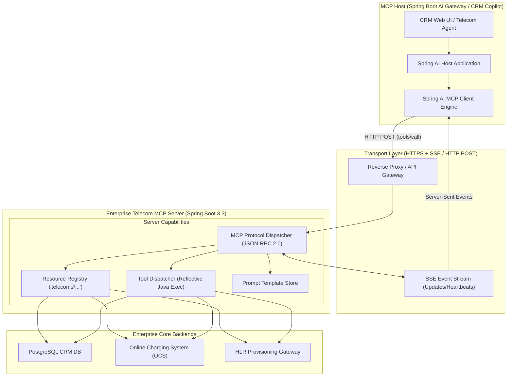

# 18. Model Context Protocol (MCP): Senior Architecture Guide
> **Version warning:** MCP changes over time. Treat examples as protocol concepts or pinned-version exercises. Verify the current specification and transport before implementing; legacy HTTP+SSE examples may not be the current default.
**Target Profile:** Senior Product Software Engineer / AI-Enabled Backend Engineer (MCP Architecture, JSON-RPC 2.0, Transports: SSE vs. stdio, Spring AI MCP, Enterprise Tool Hubs, Security Sandboxing)  
**Author:** Siva Prasad Vajja  
**Domain Alignment:** Telecom CRM, Enterprise Platform Integration, Standardized Tool Infrastructure, Multi-Agent Ecosystems  

---

## 1. Definition
The **Model Context Protocol (MCP) at the Senior Engineering Level** is an open, standardized, language-agnostic protocol that formalizes how generative AI models and applications (Hosts/Clients) securely discover, access, and interact with external data sources, business microservices, and execution tools (Servers).

Analogous to how the **Language Server Protocol (LSP)** decoupled programming languages from IDEs, or how **USB-C** standardized physical peripheral hardware, MCP eliminates point-to-point bespoke integrations by defining a universal specification over **JSON-RPC 2.0**. It formalizes three fundamental enterprise primitives:
1. **Resources:** Read-only data endpoints (e.g., database records, system logs, documentation).
2. **Tools:** Executable functions with operational side effects (e.g., API calls, database writes, provisioning commands).
3. **Prompts:** Pre-engineered, server-managed prompt templates and workflows.

---

## 2. Why It Exists
In enterprise software architectures (such as Telecom BSS, CRM, and multi-tenant SaaS):
1. **The $M \times N$ Integration Nightmare:** Prior to MCP, if an enterprise possessed $M$ AI clients (Spring AI microservices, LangChain agents, developer IDEs, customer support copilots) and $N$ backend systems (PostgreSQL, Telecom OCS, JIRA, Kafka, CRM Core), developers were forced to build and maintain $M \times N$ custom tool adapters.
2. **Standardizing on $M + N$ Open Protocol:** With MCP, the enterprise writes **one** MCP Server for the Telecom Billing engine. Immediately, *any* MCP-compliant client or host can dynamically discover its tools, read its schemas, and execute functions without custom glue code.
3. **Dynamic Discovery without Redeployment:** When an engineer adds a new diagnostic tool to the enterprise MCP server, AI clients automatically discover it on their next session via `tools/list` negotiation—no client-side recompilation or redeployment required.

---

## 3. Problem It Solves
* **SDK Fragmentation & Vendor Lock-In:** Replaces proprietary tool-calling formats (OpenAI Functions vs. Anthropic Tool Use vs. Bedrock schemas) with a single universal standard.
* **Security Boundaries & Sandboxing:** Provides a clean separation between the Host (which controls user permission gates and LLM access) and the Server (which encapsulates isolated domain logic).
* **Context Streaming & Large Data Transport:** Standardizes how massive enterprise documents are paginated, streamed, and URI-addressed via MCP Resources.

---

## 4. Internal Working

### 4.1 The Three Core MCP Primitives

```
+-------------------------------------------------------------------------------------------------+
|                                    THE THREE MCP PRIMITIVES                                     |
+-------------------------------------------------------------------------------------------------+
| 1. RESOURCES (Read-Only State, URI-Addressed)                                                   |
|    - telecom://subscribers/{msisdn}/billing-summary                                             |
|    - Equivalent to HTTP GET; idempotent, zero side-effects.                                     |
|    - Emits real-time updates to clients via resource change notifications.                     |
+-------------------------------------------------------------------------------------------------+
| 2. TOOLS (Executable Functions with Side Effects)                                               |
|    - telecom.crm.unbarSubscriber(msisdn, reason)                                                |
|    - telecom.billing.applyCreditWaiver(msisdn, amount)                                          |
|    - Validated by JSON Schema; requires explicit host/user authorization.                       |
+-------------------------------------------------------------------------------------------------+
| 3. PROMPTS (Server-Managed Prompt Templates)                                                    |
|    - "triage-roaming-dispute"                                                                   |
|    - Centralizes complex system prompts on the server; clients request templates dynamically.   |
+-------------------------------------------------------------------------------------------------+
```

### 4.2 Transport Layers: stdio vs. SSE (Server-Sent Events)

```
+---------------------------+---------------------------------------------------------------------+
| Transport                 | Mechanics & Production Use Case                                     |
+---------------------------+---------------------------------------------------------------------+
| stdio (Standard In/Out)   | Client spawns Server as a local child OS process.                   |
|                           | Communicates via stdin/stdout pipe. Zero network overhead.          |
|                           | Standard for local AI agents, CLI tools, and desktop copilots.      |
+---------------------------+---------------------------------------------------------------------+
| SSE (Server-Sent Events)  | Distributed network microservices over HTTPS.                       |
| + HTTP POST               | Server streams events/updates to Client via SSE connection.         |
|                           | Client sends JSON-RPC requests to Server via standard HTTP POST.   |
|                           | Standard for cloud-native Kubernetes microservice architectures.   |
+---------------------------+---------------------------------------------------------------------+
```

### 4.3 JSON-RPC 2.0 Protocol Lifecycle
1. **Initialization Handshake:**
   - Client sends `initialize` with client capabilities and protocol version (`2024-11-05`).
   - Server responds with server capabilities (`tools: {}`, `resources: {}`, `prompts: {}`).
   - Client confirms with `notifications/initialized`.
2. **Dynamic Tool Discovery:**
   - Client requests `tools/list`.
   - Server returns JSON schemas for all registered functions.
3. **Execution:**
   - Client sends `tools/call` with parameters.
   - Server executes business logic and returns structured `content: [{ type: "text", text: "..." }]`.

---

## 5. Architecture



---

## 6. Important Components

| Component | Responsibility | Technical Specification |
|---|---|---|
| **MCP Host** | Coordinates AI models, security permissions, and user interactions. | Spring AI application or Claude Desktop / Agent runtime. |
| **MCP Client** | Maintains the bidirectional connection, serialization, and protocol state. | `io.modelcontextprotocol.client:mcp-client` |
| **MCP Server** | Exposes enterprise resources, tools, and prompts over standard transports. | `io.modelcontextprotocol.server:mcp-server` |
| **JSON-RPC Engine** | Serializes requests/responses into RFC 7159 / JSON-RPC 2.0 envelopes. | Jackson `ObjectMapper` + MCP specification schemas. |
| **Transport Adapter** | Manages OS process pipes (`stdio`) or HTTP SSE connections. | Spring WebFlux / Netty / Servlet 6. |

---

## 7. Example: JSON-RPC 2.0 Message Exchange Trace

### 1. Client Requests Available Tools (`tools/list`)
```json
{
  "jsonrpc": "2.0",
  "id": 1,
  "method": "tools/list",
  "params": {}
}
```

### 2. Server Exposes Telecom Tool Schema
```json
{
  "jsonrpc": "2.0",
  "id": 1,
  "result": {
    "tools": [
      {
        "name": "telecom_unbar_subscriber",
        "description": "Restore suspended telecom services on a subscriber SIM line",
        "inputSchema": {
          "type": "object",
          "properties": {
            "msisdn": { "type": "string", "pattern": "^[0-9]{10,12}$", "description": "Subscriber MSISDN" },
            "reason": { "type": "string", "enum": ["PAYMENT_RECEIVED", "GOODWILL_PROMO", "SUPERVISOR_OVERRIDE"] }
          },
          "required": ["msisdn", "reason"]
        }
      }
    ]
  }
}
```

### 3. Client Executes Tool (`tools/call`)
```json
{
  "jsonrpc": "2.0",
  "id": 2,
  "method": "tools/call",
  "params": {
    "name": "telecom_unbar_subscriber",
    "arguments": {
      "msisdn": "9845012345",
      "reason": "PAYMENT_RECEIVED"
    }
  }
}
```

### 4. Server Returns Execution Result
```json
{
  "jsonrpc": "2.0",
  "id": 2,
  "result": {
    "content": [
      {
        "type": "text",
        "text": "{\"status\":\"SUCCESS\",\"transactionId\":\"TX-88412\",\"message\":\"HLR unbarring command transmitted.\"}"
      }
    ],
    "isError": false
  }
}
```

---

## 8. Java/Spring Boot Example: Enterprise MCP Server

### 8.1 Maven Dependency
```xml
<dependency>
    <groupId>org.springframework.ai</groupId>
    <artifactId>spring-ai-mcp-server-spring-boot-starter</artifactId>
    <version>1.0.0-M6</version>
</dependency>
```

### 8.2 Production Telecom MCP Server Implementation
```java
package com.sixdee.crm.mcp.server;

import org.slf4j.Logger;
import org.slf4j.LoggerFactory;
import org.springframework.ai.mcp.annotation.McpResource;
import org.springframework.ai.mcp.annotation.McpTool;
import org.springframework.ai.mcp.annotation.McpToolParam;
import org.springframework.stereotype.Service;

import java.math.BigDecimal;
import java.time.Instant;

@Service
public class TelecomEnterpriseMcpServer {

    private static final Logger log = LoggerFactory.getLogger(TelecomEnterpriseMcpServer.class);

    // 1. Expose a Read-Only Resource (URI: telecom://subscribers/{msisdn}/profile)
    @McpResource(uri = "telecom://subscribers/{msisdn}/profile", name = "Subscriber Profile Resource")
    public String getSubscriberProfileResource(String msisdn) {
        log.info("MCP Server reading resource for subscriber: {}", msisdn);
        // Fetch from PostgreSQL CRM DB
        return String.format("""
            {
              "msisdn": "%s",
              "tier": "GOLD",
              "activePlan": "Corporate 5G Unlimited",
              "accountStatus": "ACTIVE",
              "outstandingBalance": 12.50,
              "lastPaymentDate": "2026-09-01"
            }
            """, msisdn);
    }

    // 2. Expose an Executable Tool with Side Effects
    @McpTool(name = "telecom_apply_account_credit", description = "Credit a financial waiver to subscriber balance")
    public CreditActionResult applyAccountCredit(
            @McpToolParam(name = "msisdn", description = "The 10-digit subscriber number", required = true) String msisdn,
            @McpToolParam(name = "amount", description = "Dollar credit amount (max 25.00)", required = true) BigDecimal amount,
            @McpToolParam(name = "justification", description = "Audit justification", required = true) String justification) {

        log.info("MCP Tool Executing: Apply Credit of ${} to MSISDN: {}", amount, msisdn);

        if (amount.compareTo(new BigDecimal("25.00")) > 0) {
            return new CreditActionResult(msisdn, false, "ERROR: Exceeds automated limit of $25.00.");
        }

        // Execute transaction against OCS
        String txnId = "CR-" + Instant.now().toEpochMilli();
        return new CreditActionResult(msisdn, true, "Credit applied successfully. Transaction ID: " + txnId);
    }

    public record CreditActionResult(String msisdn, boolean success, String details) {}
}
```

---

## 9. Production Use Case: Enterprise Telecom AI Tool Hub
In **6D Technologies CRM platforms**:
1. **The Architecture:** Build a centralized **Telecom Enterprise MCP Server** deployed on AWS EKS. It encapsulates tools for HLR unbarring, OCS rating inquiries, billing adjustments, and network cell tower health checks.
2. **Universal Client Consumption:**
   - **Internal CRM Copilot:** Calls the MCP server via SSE transport to assist human call-center agents.
   - **Autonomous Batch Triage Agent:** Connects to the same MCP server via HTTP to triage nightly bulk disputes.
   - **Network Operations Center (NOC) Assistant:** Queries MCP resources to correlate subscriber drop-call complaints with live tower alarm logs.
3. **Business Value:** Zero duplicated backend API code across AI projects; centralized security auditing and permission gating for all AI-driven actions.

---

## 10. Common Mistakes in MCP Implementation

| Anti-Pattern | Consequence | Engineering Fix |
|---|---|---|
| **Exposing Unbounded Tools** | Exposing `executeRawSql(query)` or `runShellCommand(cmd)`. | High security hazard. Tools must be narrow, strongly-typed, and bounded domain functions. |
| **Blocking SSE Threads** | Executing a 15-second synchronous external call on the Netty SSE event thread. | Offload long-running tool logic to a bounded Java worker thread pool (`CompletableFuture`). |
| **Neglecting URI Validation** | Failing to validate `{msisdn}` in `telecom://subscribers/{msisdn}`. | Validate path variables against regex patterns before querying backend databases. |
| **Missing Error Envelopes** | Throwing uncaught Java exceptions that break JSON-RPC framing. | Catch exceptions and return standard JSON-RPC error objects: `{ "code": -32603, "message": "..." }`. |
| **Ignoring Keep-Alive Heartbeats** | Cloud firewalls or load balancers drop idle SSE connections after 60s. | Configure periodic JSON-RPC ping/heartbeat frames over SSE every 15–30 seconds. |

---

## 11. Performance Considerations

### 11.1 stdio vs. SSE Throughput
* **stdio:** Sub-millisecond roundtrip latency ($< 0.5$ms); zero network serialization overhead. Ideal when hosting the MCP server inside the same container or as a local sidecar daemon.
* **SSE / HTTPS:** Incurs TLS handshake, HTTP header overhead, and network latency ($10\text{ms} - 50\text{ms}$). Crucial to maintain persistent HTTP/2 connections to avoid repeated TLS handshakes.

### 11.2 Tool Schema Caching on the Host
* Clients should not invoke `tools/list` before every prompt.
* Cache the server's tool catalog in the MCP Client memory. Listen for `notifications/tools/list_changed` events emitted by the server to invalidate the cache dynamically.

---

## 12. Security Considerations: Host-Level Human Authorization
The core security philosophy of MCP is **Host Sovereignty**:
* The MCP Server proposes tools and actions.
* The **Host Application** (not the server) owns the security boundary and user consent:
  ```
  +-------------------------------------------------------------+
  |              MCP SECURITY PERMISSION DIALOG                 |
  +-------------------------------------------------------------+
  | AI Agent requests execution of Tool:                        |
  | -> Name: telecom_apply_account_credit                       |
  | -> Parameters: { msisdn: "9845012345", amount: 20.00 }      |
  |                                                             |
  | [ ALLOW ONCE ]   [ ALWAYS ALLOW FOR SESSION ]   [ DENY ]    |
  +-------------------------------------------------------------+
  ```
* Protect SSE endpoints with **OAuth2 / Bearer Tokens** and **Mutual TLS (mTLS)** inside Kubernetes clusters.

---

## 13. Core Interview Questions (With Senior Answers)

### Q1: What is the Model Context Protocol (MCP), and what fundamental architectural problem does it solve?
**Answer:** MCP is an open, standardized protocol developed to standardize how AI applications (Hosts/Clients) connect with external tools, resources, and prompt templates (Servers). Prior to MCP, connecting AI applications to disparate databases and APIs required custom, vendor-specific code for every combination ($M \times N$). MCP replaces this with a universal JSON-RPC 2.0 specification ($M + N$), allowing any MCP-compliant AI client to dynamically discover and consume tools and resources from any MCP server over standard transports like `stdio` and `SSE`.

### Q2: Explain the difference between an MCP Resource and an MCP Tool.
**Answer:** An MCP **Resource** is an application-controlled, read-only data primitive addressed via a URI (e.g., `telecom://subscribers/123/bills`). It is idempotent and carries no operational side effects, functioning like an HTTP GET for context injection. An MCP **Tool** is an executable function with potential side effects (e.g., invoking an external API, updating a database, charging a customer balance). Tools require strict JSON Schema validation and typically demand host-level permission authorization before execution.

### Q3: Why does MCP support both `stdio` and `SSE` transports?
**Answer:** `stdio` (standard input/output) runs the MCP server as a local child process. It delivers near-zero latency ($< 1$ms) and requires no open network ports, making it ideal for desktop agents, developer CLI tooling, and single-host environments. `SSE` (Server-Sent Events) combined with HTTP POST is designed for distributed, cloud-native architectures. It allows independent Kubernetes microservices to stream updates and execute tools remotely across network boundaries over secure HTTPS.

### Q4: How does dynamic tool discovery work during the MCP initialization phase?
**Answer:** During the initial handshake, the client sends an `initialize` JSON-RPC request specifying its protocol version and capabilities. The server replies with its supported features. Once initialized, the client invokes `tools/list`. The server returns an array of tool descriptors, each containing the tool name, human-readable description, and a complete JSON Schema defining required and optional parameters. The client registers these schemas into the LLM's context window.

---

## 14. Deep Architectural Interview Questions (Senior/Staff Level)

### Q1: How do you design an enterprise-grade, multi-tenant MCP Gateway that enforces fine-grained access control across hundreds of microservice tools?
**Answer:**  
"In an enterprise platform like Telecom CRM:
1. **Centralized MCP Reverse Proxy:** Deploy an API Gateway / MCP Reverse Proxy (built on Spring Cloud Gateway) fronting internal MCP servers.
2. **OAuth2 / JWT Token Propagation:** When an AI client connects over SSE, it passes an enterprise JWT token in the `Authorization: Bearer` header.
3. **Dynamic Tool Filtering:** When the client sends `tools/list`, the Gateway inspects the caller's JWT scopes:
   - Tier-1 support agents receive read-only tools and minor credit tools ($< \$25$).
   - Tier-2 supervisors receive account unbarring and high-value adjustment tools.
   - The Gateway dynamically filters the `tools/list` JSON response, preventing unauthorized tools from ever reaching the LLM's awareness.
4. **Execution-Time Verification:** On `tools/call`, the Gateway validates the caller's permissions before forwarding the JSON-RPC frame to the target microservice MCP server."

### Q2: How does MCP compare to the OpenAPI (Swagger) specification for tool calling?
**Answer:**  
"OpenAPI is a static REST API documentation standard designed for human developers and code-generation SDKs. It defines HTTP verbs, status codes, and endpoints.  
MCP is a stateful, bidirectional runtime protocol designed specifically for AI agent integration:
- **Bidirectional Communication:** Unlike REST, MCP supports server-initiated notifications (e.g., streaming resource updates to the agent over SSE).
- **Three Unified Primitives:** MCP encapsulates Resources, Tools, and Prompts under a single protocol, whereas OpenAPI only models endpoints.
- **Dynamic Negotiation:** MCP supports real-time capability negotiation and runtime tool updates without requiring client schema recompilation."

---

## 15. Comparison with Alternatives

| Feature / Standard | Model Context Protocol (MCP) | OpenAPI / REST | gRPC | Direct Function Calling (OpenAI) |
|---|---|---|---|---|
| **Primary Audience** | AI Models, Agents, Tools | Web Services, Developers | High-throughput microservices | Single LLM provider |
| **Protocol Framing** | JSON-RPC 2.0 | HTTP/REST | Protocol Buffers (Binary) | Provider-specific JSON |
| **Transport** | stdio, SSE + HTTP | HTTP 1.1 / HTTP/2 | HTTP/2 | HTTPS |
| **Bidirectional Streaming** | Yes (SSE notifications) | No (requires WebSockets) | Yes (Bidirectional gRPC) | No |
| **Vendor Neutrality** | Open standard | Open standard | Open standard | Proprietary vendor lock-in |
| **Discovery Model** | Runtime (`tools/list`) | Static YAML/JSON schema | Proto file compilation | Static prompt payload |

---

## 16. When NOT to Use MCP
1. **Internal High-Throughput Service-to-Service RPC:** For high-speed internal backend communication between Java microservices processing 50,000 transactions/second (e.g., CDR rating or payment settlement), use **gRPC** with binary Protobuf serialization.
2. **Simple Single-Turn Form Validation:** If you only need to parse a phone number or validate an email in a single Spring Boot controller, standard Java code or a basic `@Tool` is simpler than deploying an MCP server.

---

## 17. Hands-On Exercise: Unit Testing an MCP Tool Handler

```java
package com.sixdee.crm.mcp.server;

import org.junit.jupiter.api.DisplayName;
import org.junit.jupiter.api.Test;

import java.math.BigDecimal;

import static org.assertj.core.api.Assertions.assertThat;

class TelecomEnterpriseMcpServerTest {

    @Test
    @DisplayName("MCP credit tool must reject amounts exceeding $25.00 limit")
    void testCreditLimitEnforcement() {
        TelecomEnterpriseMcpServer server = new TelecomEnterpriseMcpServer();

        // Attempt waiver of $30.00
        var result = server.applyAccountCredit("9845012345", new BigDecimal("30.00"), "Customer complaint");

        assertThat(result.success()).isFalse();
        assertThat(result.details()).contains("Exceeds automated limit of $25.00");
    }

    @Test
    @DisplayName("MCP credit tool must succeed for valid authorized amounts")
    void testCreditSuccess() {
        TelecomEnterpriseMcpServer server = new TelecomEnterpriseMcpServer();

        var result = server.applyAccountCredit("9845012345", new BigDecimal("15.00"), "Goodwill adjustment");

        assertThat(result.success()).isTrue();
        assertThat(result.details()).contains("Credit applied successfully");
    }
}
```

---

## 18. Project Application: Telecom CRM Core Platform
Illustrative MCP project application (not current 6D production evidence):
* **The CRM MCP Enterprise Gateway:**
  - Wrap existing CRM core REST endpoints into a unified Spring Boot MCP server.
  - Expose subscriber profile resources (`telecom://subscriber/{msisdn}`) and operational tools (SIM swap, unbarring, tariff updates).
  - Enables any modern AI agent (whether running inside an internal developer IDE or deployed as a customer self-care agent) to interact safely with the 6D Core Platform via open industry standards.

---

## 19. Senior-Level Interview Answer (The "Gold Standard")

> *"In modern enterprise AI architecture, the Model Context Protocol (MCP) is the crucial missing standard that solves the $M \times N$ tool integration problem.  
>  
> *Rather than hardcoding proprietary function schemas for each LLM provider, MCP standardizes tool calling, resource streaming, and prompt management over JSON-RPC 2.0. In our enterprise ecosystem, we build centralized MCP servers using Spring Boot and Spring AI MCP starters, exposing our core telecom databases and business services over secure SSE and stdio transports.  
>  
> *This architecture enforces the principle of Host Sovereignty: the MCP server exposes strongly-typed tools validated against JSON Schemas, but the Host application retains ultimate governance, prompting human supervisors for confirmation whenever an AI agent attempts to invoke high-impact operational tools like balance credits or SIM unbarring."*

---

## 20. Real-World Troubleshooting Scenarios

### Scenario A: Client Disconnects / SSE Connection Drop during Tool Execution
* **Symptom:** MCP Client loses connection to the server after 60 seconds of inactivity; subsequent tool calls fail with `Connection refused`.
* **Root Cause:** Enterprise cloud load balancers (e.g., AWS ALB) terminate idle HTTP/SSE connections that exhibit no traffic for 60 seconds.
* **Fix:** Configure the Spring Boot MCP server to emit periodic JSON-RPC keep-alive ping frames every 20 seconds over the SSE stream.

### Scenario B: Tool Call Argument Deserialization Failure
* **Symptom:** Client receives JSON-RPC error: `{"code": -32602, "message": "Invalid params"}`.
* **Root Cause:** The LLM passed an argument as a string (`"amount": "25.00"`), but the server-side Java method expected a numerical type or strict JSON object.
* **Fix:** Configure the Jackson `ObjectMapper` in the Spring MCP server with `DeserializationFeature.ACCEPT_EMPTY_STRING_AS_NULL_OBJECT` and register custom coercers for `BigDecimal` and numbers.

### Scenario C: Host Freezes on Massive Resource Streaming
* **Symptom:** AI Host application runs out of memory when querying `telecom://subscribers/logs/all`.
* **Root Cause:** The MCP server returned an unpaginated 50MB raw log dump in a single JSON-RPC response frame.
* **Fix:** Implement MCP cursor-based pagination for Resources:
  ```json
  {
    "method": "resources/read",
    "params": { "uri": "telecom://subscribers/logs", "cursor": "page_2" }
  }
  ```
