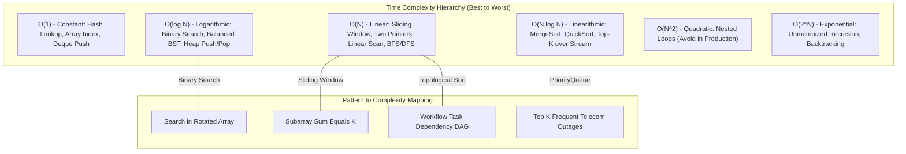

# 20. Data Structures & Algorithms: Senior Product Engineer Guide
> **Evidence warning:** Telecom performance stories and numeric outcomes are illustrative coding exercises unless independently evidenced.
**Target Profile:** Senior Product Software Engineer (Problem Solving, High-Frequency Patterns, Concurrency-Safe Primitives, Space/Time Complexity, Clean Java Idioms)  
**Author:** Siva Prasad Vajja  
**Domain Alignment:** Telecom CRM, High-Throughput Event Processing, Distributed Caches, Real-Time Billing  

---

## 1. Definition
**Data Structures and Algorithms (DSA) at the Senior Product Engineer Level** is not about memorizing academic trivia or solving esoteric puzzles. It is the disciplined engineering ability to:
1. **Deconstruct Ambiguous Real-World Problems** into fundamental mathematical models (Graphs, Trees, Hash Tables, Heaps, Intervals).
2. **Select the Optimal Trade-Off** between Time Complexity ($O(1), O(\log N), O(N)$), Space Complexity ($O(1)$ vs. $O(N)$), and Hardware Reality (CPU L1/L2 cache locality vs. pointer chasing, Garbage Collection allocation pressure).
3. **Write Bug-Free, Idiomatic, Thread-Safe Code** with clean variable naming, modular decomposition, and airtight edge-case handling under live interview conditions.

In Tier-1 product companies (such as Salesforce, Freshworks, Razorpay, CSG, MATRIXX, Zoho), interviewers evaluate how you communicate your thought process, identify boundary conditions, validate inputs, and transition from a brute-force $O(N^2)$ approach to an optimal $O(N)$ or $O(N \log K)$ solution.

---

## 2. Why It Exists in Senior Interviews
1. **Separating Framework Users from Engineers:** Anyone can annotate a Spring Boot controller with `@RestController`. DSA rounds evaluate whether you understand the computational cost of what happens inside that controller when processing 500,000 subscriber records.
2. **Predicting Code Quality in Distributed Systems:** An engineer who doesn't understand hash collisions, amortized array resizing, or graph cycle detection will inadvertently introduce production deadlocks, memory leaks, and CPU spikes.
3. **Communication Under Pressure:** Product companies use coding rounds as a proxy for collaborative pair programming. They observe how you receive hints, handle trade-offs, and defend architectural choices.

---

## 3. Problem It Solves
* **Unbounded Latency ($O(N^2)$ Traps):** Eliminates nested loops over millions of records by using Hash Maps, Two Pointers, or Sliding Windows.
* **Memory Exhaustion & GC Thrashing:** Replaces node-heavy linked structures with contiguous array buffers when CPU cache locality is paramount.
* **Concurrency Race Conditions:** Replaces naive synchronization with lock-free structures (`ConcurrentHashMap`, `AtomicReference`, `LongAdder`).
* **Complex Dependency Resolution:** Resolves circular dependencies in service task DAGs using Topological Sort (Kahn’s Algorithm).

---

## 4. Internal Working: Core Data Structure Internals

### 4.1 Memory Layout: Arrays vs. Node-Based Structures
```
Contiguous Array (ArrayList):
[ Element 0 ][ Element 1 ][ Element 2 ][ Element 3 ]  <-- L1/L2 Cache Prefetcher Friendly!

Linked List / Tree (Node-based):
[ Node A | ptr ] ---> (Random Heap Address) ---> [ Node B | ptr ]  <-- Pointer Chasing & Cache Misses!
```
* **CPU Cache Locality:** Modern CPUs fetch 64-byte Cache Lines from RAM. An array of primitives or contiguous object references allows sequential spatial prefetching. Linked structures scatter objects across the JVM heap, causing frequent L1/L2 cache misses ($~100\text{x}$ slower than L1 hits).

### 4.2 Hash Collisions & Amortized Resizing
* **Load Factor ($\alpha = 0.75$):** When `size >= capacity * 0.75`, the internal array doubles ($2^N$). Resizing is an $O(N)$ operation, but happens infrequently enough that insertions maintain an **Amortized $O(1)$** cost.
* **Hash Spreading:** `(h = key.hashCode()) ^ (h >>> 16)` ensures high-order bits influence lower-order table indexes, mitigating clustering from poor custom `hashCode()` implementations.

### 4.3 High-Frequency Algorithmic Patterns
```
+----------------------------------------------------------------------------------------------------+
|                                    TOP 8 SENIOR CODING PATTERNS                                    |
+----------------------------------------------------------------------------------------------------+
| 1. Two Pointers / Sliding Window   | Subarray/substring problems, contiguous memory, O(N) time.     |
| 2. Fast & Slow Pointers (Floyd)    | Cycle detection in linked lists and state machines.            |
| 3. Monotonic Stack / Queue         | Next greater element, histogram problems, stock span.          |
| 4. Top-K / Heap (PriorityQueue)    | K largest elements, real-time median, rate-limiting windows.   |
| 5. Topological Sort (Kahn's / DFS) | DAG dependency resolution (Camunda tasks, Maven builds).       |
| 6. Trie (Prefix Tree)              | Autocomplete, IP routing (CIDR lookup), phone number matching. |
| 7. Binary Search on Answer Space   | Optimization problems ("Find min speed to finish in H hours"). |
| 8. Union-Find (Disjoint Set)       | Connected network components, cell tower cluster merging.      |
+----------------------------------------------------------------------------------------------------+
```

---

## 5. Architecture: The Complexity Hierarchy



---

## 6. Important Components

| Data Structure / Utility | Standard Java Class | Access | Search | Insert | Delete | Space |
|---|---|:---:|:---:|:---:|:---:|:---:|
| **Dynamic Array** | `ArrayList<T>` | $O(1)$ | $O(N)$ | $O(1)^*$ | $O(N)$ | $O(N)$ |
| **Hash Table** | `HashMap<K, V>` | N/A | $O(1)$ | $O(1)$ | $O(1)$ | $O(N)$ |
| **Thread-Safe Map** | `ConcurrentHashMap<K, V>` | N/A | $O(1)$ | $O(1)$ | $O(1)$ | $O(N)$ |
| **Balanced BST** | `TreeMap<K, V>` | N/A | $O(\log N)$| $O(\log N)$| $O(\log N)$| $O(N)$ |
| **Binary Heap** | `PriorityQueue<T>` | $O(1)$ (peek) | $O(N)$ | $O(\log N)$| $O(\log N)$| $O(N)$ |
| **Double-Ended Queue** | `ArrayDeque<T>` | $O(1)$ | $O(N)$ | $O(1)$ | $O(1)$ | $O(N)$ |
| **Prefix Tree** | Custom `TrieNode` | N/A | $O(L)$ | $O(L)$ | $O(L)$ | $O(N \cdot L)$ |

---

## 7. Example: Production-Grade LRU Cache (Clean Java 17)
The classic senior product interview question: Implement a **Least Recently Used (LRU) Cache** with $O(1)$ `get` and $O(1)$ `put` using a custom Doubly Linked List and `HashMap` (without relying on `LinkedHashMap`).

```java
package com.sixdee.crm.dsa;

import java.util.HashMap;
import java.util.Map;

public class LRUCache<K, V> {

    private static class Node<K, V> {
        K key;
        V value;
        Node<K, V> prev;
        Node<K, V> next;

        Node(K key, V value) {
            this.key = key;
            this.value = value;
        }
    }

    private final int capacity;
    private final Map<K, Node<K, V>> cache;
    private final Node<K, V> head; // Dummy head
    private final Node<K, V> tail; // Dummy tail

    public LRUCache(int capacity) {
        if (capacity <= 0) {
            throw new IllegalArgumentException("Capacity must be positive");
        }
        this.capacity = capacity;
        this.cache = new HashMap<>(capacity);
        this.head = new Node<>(null, null);
        this.tail = new Node<>(null, null);
        head.next = tail;
        tail.prev = head;
    }

    public synchronized V get(K key) {
        Node<K, V> node = cache.get(key);
        if (node == null) {
            return null;
        }
        moveToHead(node);
        return node.value;
    }

    public synchronized void put(K key, V value) {
        Node<K, V> node = cache.get(key);
        if (node != null) {
            node.value = value;
            moveToHead(node);
        } else {
            if (cache.size() >= capacity) {
                Node<K, V> evicted = removeTail();
                cache.remove(evicted.key);
            }
            Node<K, V> newNode = new Node<>(key, value);
            cache.put(key, newNode);
            addToHead(newNode);
        }
    }

    private void moveToHead(Node<K, V> node) {
        removeNode(node);
        addToHead(node);
    }

    private void addToHead(Node<K, V> node) {
        node.next = head.next;
        node.prev = head;
        head.next.prev = node;
        head.next = node;
    }

    private void removeNode(Node<K, V> node) {
        node.prev.next = node.next;
        node.next.prev = node.prev;
    }

    private Node<K, V> removeTail() {
        Node<K, V> lastNode = tail.prev;
        removeNode(lastNode);
        return lastNode;
    }
}
```

---

## 8. Java/Spring Example: Thread-Safe Sliding Window Rate Limiter
A premier coding problem for telecom backend engineers: Implement an in-memory Sliding Window Rate Limiter allowing at most $K$ requests per second.

```java
package com.sixdee.crm.dsa.ratelimit;

import java.time.Instant;
import java.util.ArrayDeque;
import java.util.Deque;
import java.util.Map;
import java.util.concurrent.ConcurrentHashMap;

public class SlidingWindowRateLimiter {

    private final int maxRequests;
    private final long windowSizeMillis;
    private final Map<String, Deque<Long>> userRequestTimestamps = new ConcurrentHashMap<>();

    public SlidingWindowRateLimiter(int maxRequests, long windowSizeMillis) {
        this.maxRequests = maxRequests;
        this.windowSizeMillis = windowSizeMillis;
    }

    public boolean allowRequest(String msisdn) {
        long now = Instant.now().toEpochMilli();
        long windowStart = now - windowSizeMillis;

        // Synchronize on the specific user's queue to achieve fine-grained concurrency
        Deque<Long> timestamps = userRequestTimestamps.computeIfAbsent(msisdn, k -> new ArrayDeque<>());

        synchronized (timestamps) {
            // Evict timestamps older than the sliding window start
            while (!timestamps.isEmpty() && timestamps.peekFirst() <= windowStart) {
                timestamps.pollFirst();
            }

            // Check if current count is within limit
            if (timestamps.size() < maxRequests) {
                timestamps.addLast(now);
                return true; // Request allowed
            } else {
                return false; // Rate limit exceeded
            }
        }
    }
}
```

---

## 9. Production Use Cases in Telecom CRM & Distributed Systems
1. **CDR (Call Detail Record) Deduplication:** High-throughput streaming deduplication using a sliding-window Bloom Filter combined with an in-memory LRU cache to drop duplicate calls within a 5-minute window.
2. **Top-K High-Usage Subscribers:** Using a bounded Min-Heap of size $K = 100$ over incoming Kafka stream events to track real-time highest data consumers without sorting millions of subscribers ($O(N \log K)$ vs $O(N \log N)$).
3. **Prefix Phone Number (MSISDN) Routing via Trie:** Telecom carriers route calls based on international dial codes (e.g., `+1-415`, `+44-20`). A Trie data structure evaluates the longest prefix match in $O(L)$ time (where $L$ is phone number length, $\le 15$), vastly outperforming database lookups.
4. **Camunda Workflow DAG Dependency Resolution:** Topological sorting (Kahn’s Algorithm) detects circular task dependencies before deploying BPMN workflows into production.

---

## 10. Common Mistakes in Senior Coding Interviews

| Mistake | Interviewer Perception | Senior Engineering Fix |
|---|---|---|
| **Immediate Coding without Clarification** | "Lacks product thinking; builds wrong solution." | Ask clarifying questions: Scale ($N$)? Duplicate keys allowed? Thread safety required? Memory bounds? |
| **Ignoring Boxed Primitive Overhead** | Using `Integer` inside high-frequency collections, causing 16-byte object overhead + boxing churn. | Mention memory cost: *"In production with 10M integers, I'd prefer `Trove` or `fastutil` primitive collections."* |
| **Recursion without Base Case or Depth Check** | Code throws `StackOverflowError` on deep linked lists or trees. | Convert deep recursion to an iterative approach using an explicit `ArrayDeque` stack. |
| **Using `LinkedList` by Default** | "Junior misconception that linked lists are always faster." | State trade-off: `ArrayList` has superior cache locality and less memory overhead; `LinkedList` incurs heavy GC pointer costs. |
| **Silent Edge Case Failures** | Array index out-of-bounds on empty inputs (`null`, `[]`, length 1). | Handle boundary guards at the very first lines of every method. |

---

## 11. Performance & Hardware Considerations

### 11.1 Cache Locality & Java Memory Footprint
* An empty `java.lang.Object` on a 64-bit JVM with Compressed OOPs (`-XX:+UseCompressedOops`) consumes **16 bytes** (12-byte header + 4-byte padding).
* A `java.lang.Integer` consumes **24 bytes** to store a 4-byte integer!
* A `LinkedList.Node` contains: Node object (16B) + element reference (4B) + prev reference (4B) + next reference (4B) = **24–32 bytes overhead per element**.
* *Senior Takeaway:* Prefer `ArrayList` or flat array structures for high-throughput in-memory pipelines to maximize L1/L2 cache hit rates and minimize garbage collection pauses.

---

## 12. Security Considerations: Algorithmic Vulnerabilities
1. **HashDoS (Denial of Service via Hash Collisions):**
   - In Java 7, if an attacker crafted thousands of string keys sharing the exact same `hashCode()`, the HashMap degraded to a single linked list ($O(N)$ lookups), pegging CPU at 100%.
   - **Java 8+ Defense:** When a single bin reaches 8 collisions and table capacity $\ge 64$, Java transforms the bin into a **Red-Black Tree** ($O(\log N)$ worst-case).
2. **ReDoS (Regular Expression Denial of Service):**
   - Catastrophic backtracking in regex with overlapping nested quantifiers (e.g., `(a+)+$`). Always use bounded regex or deterministic state machines.

---

## 13. Core Interview Questions (With Senior Answers)

### Q1: Why did Java 8 replace `ConcurrentHashMap` Segment locks with CAS and `synchronized` on bin heads?
**Answer:** In Java 7, `ConcurrentHashMap` used an array of 16 `Segment` locks (each extending `ReentrantLock`). This capped concurrency at 16 independent writers and incurred heavy object memory overhead. Java 8 removed segments entirely:
1. Inserting the first node into an empty bin uses **lock-free CAS (Compare-And-Swap)** via `Unsafe`/`VarHandle`.
2. For populated bins, it locks **only the individual head node** of that specific bucket using `synchronized(head)`. This scales concurrency dynamically with the number of bins ($N$), allowing thousands of non-conflicting concurrent writes while completely eliminating lock overhead for reads (`volatile`).

### Q2: What is the time and space complexity of sorting in Java (`Arrays.sort` vs `Collections.sort`)?
**Answer:**
- **Primitive arrays (`int[]`, `long[]`):** Uses **Dual-Pivot QuickSort**. Time complexity: Average $O(N \log N)$, worst-case $O(N^2)$ (mitigated by pivot selection). Space complexity: $O(\log N)$ recursion stack. It is not stable, which does not matter for primitives.
- **Object arrays (`T[]`, `List<T>`):** Uses **TimSort** (an adaptive hybrid of MergeSort and InsertionSort). Time complexity: Worst-case $O(N \log N)$, best-case $O(N)$ for partially sorted arrays. Space complexity: $O(N)$ temporary memory buffer. TimSort is **stable** (preserving original order of equal elements).

### Q3: When should you use `ArrayDeque` instead of `Stack` or `LinkedList`?
**Answer:** Always use `ArrayDeque` when implementing a Stack or Queue.
- The legacy `java.util.Stack` extends `Vector`, making every operation `synchronized` (heavy locking overhead on single threads).
- `LinkedList` implements `Deque`, but allocates a new `Node` object on every insertion, creating heavy GC allocation churn and poor CPU cache locality.
- `ArrayDeque` is backed by a circular resizable array. It is unsynchronized, avoids node allocation overhead, and provides amortized $O(1)$ operations with superior cache performance.

### Q4: How does a Monotonic Stack work, and when do you use it?
**Answer:** A Monotonic Stack maintains its elements in strictly ascending or descending order. When pushing a new element, elements that violate the monotonic property are popped. It is the optimal pattern for **"Next Greater Element"** or **"Previous Smaller Element"** problems, processing the entire array in **$O(N)$ time** because each element is pushed and popped at most once.

---

## 14. Deep Architectural Interview Questions (Senior/Staff Level)

### Q1: How do you design an in-memory Top-K Frequent URL/MSISDN Tracker processing 100,000 events/second with bounded memory?
**Answer:**  
"In a high-throughput production environment, maintaining an unbounded frequency map leads to `OutOfMemoryError`. We implement a two-tier streaming architecture:
1. **Count-Min Sketch (Probabilistic Data Structure):** A sub-linear memory frequency table using $d$ hash functions over an array of counters ($w \times d$). It provides $(\epsilon, \delta)$ bounded frequency estimates in $O(1)$ time and fixed memory (e.g., 2MB RAM for 10M events).
2. **Bounded Min-Heap:** We maintain a Min-Heap of size $K$. When an item's estimated frequency from the Count-Min Sketch exceeds the root of the Min-Heap, we update the heap in $O(\log K)$ time.
3. **Decay Mechanism:** To reflect temporal locality (trending URLs in the last 15 minutes), counters are halved periodically using a time-decay factor. This achieves $O(1)$ writes, $O(\log K)$ top-K maintenance, and fixed $O(K)$ space."

### Q2: How do you detect and resolve deadlocks programmatically in a custom resource allocation engine?
**Answer:**  
"A deadlock requires four Coffman conditions: Mutual Exclusion, Hold and Wait, No Preemption, and Circular Wait.  
In software architecture, we prevent circular wait by **Global Resource Ordering**: Every resource is assigned an immutable unique integer ID. Threads must acquire locks in strictly ascending order:
```java
Resource first = r1.id < r2.id ? r1 : r2;
Resource second = r1.id < r2.id ? r2 : r1;
synchronized(first) { synchronized(second) { ... } }
```
If dynamic resource locking makes fixed ordering impossible, we model resource allocations as a **Directed Wait-For Graph (WFG)**, where nodes represent transactions and edges represent dependencies. We run **Tarjan's or Kahn's Cycle Detection** periodically in a background thread. If a cycle is detected, we preempt and abort the youngest transaction with an `OptimisticLockException`."

---

## 15. Algorithmic Trade-Off Matrix

| Problem Category | Naive Approach | Optimal Pattern | Time Complexity | Space Complexity |
|---|---|---|:---:|:---:|
| **Subarray with Sum = K** | Double loop | Prefix Sum + HashMap | $O(N)$ | $O(N)$ |
| **Longest Substring Without Repeating** | Nested check | Sliding Window + Int Array | $O(N)$ | $O(\min(N, \Sigma))$ |
| **Merge $K$ Sorted Streams** | Combine & Sort | Min-Heap (`PriorityQueue`) | $O(N \log K)$ | $O(K)$ |
| **Find Cycle in Graph / State Machine** | Brute-force paths | DFS (3-Color) or Kahn's Algorithm | $O(V + E)$ | $O(V)$ |
| **IP Routing Longest Prefix Match** | Regex scan | Trie (Prefix Tree) | $O(L)$ | $O(N \cdot L)$ |
| **Evaluate Mathematical Expression** | Complex regex | Two Stacks (Dijkstra Shunting-Yard) | $O(N)$ | $O(N)$ |

---

## 16. When NOT to Over-Engineer DSA
1. **Premature Custom Data Structures:** Writing a custom lock-free queue when standard `ConcurrentLinkedQueue` or `ArrayBlockingQueue` already handles 2M ops/second.
2. **Micro-Optimizing Small Collections ($N < 50$):** Using complex binary search trees for 20 elements. At small $N$, linear scan over an array is faster due to CPU cache lines.
3. **Complex DP for Simple Business Logic:** If business rules change frequently, clean readable code with clear `if-else` business rules is vastly preferred over a fragile Dynamic Programming matrix.

---

## 17. Hands-On Coding Snippet: Topological Sort for Workflow Engine

```java
package com.sixdee.crm.dsa.graph;

import java.util.*;

public class WorkflowDependencyResolver {

    /**
     * Resolves execution order of tasks using Kahn's Algorithm (Topological Sort).
     * @param numTasks Number of tasks (0 to numTasks - 1)
     * @param dependencies Pair [task, prerequisite]
     * @return Execution order array, or empty array if cycle detected
     */
    public int[] findOrder(int numTasks, int[][] dependencies) {
        int[] inDegree = new int[numTasks];
        Map<Integer, List<Integer>> adjList = new HashMap<>();

        for (int[] dep : dependencies) {
            int task = dep[0];
            int prereq = dep[1];
            adjList.computeIfAbsent(prereq, k -> new ArrayList<>()).add(task);
            inDegree[task]++;
        }

        Queue<Integer> queue = new ArrayDeque<>();
        for (int i = 0; i < numTasks; i++) {
            if (inDegree[i] == 0) {
                queue.offer(i);
            }
        }

        int[] order = new int[numTasks];
        int index = 0;

        while (!queue.isEmpty()) {
            int current = queue.poll();
            order[index++] = current;

            if (adjList.containsKey(current)) {
                for (int neighbor : adjList.get(current)) {
                    inDegree[neighbor]--;
                    if (inDegree[neighbor] == 0) {
                        queue.offer(neighbor);
                    }
                }
            }
        }

        // If index != numTasks, a cycle exists (deadlock / impossible dependency)
        return index == numTasks ? order : new int[0];
    }
}
```

---

## 18. Project Application: Telecom CRM Core Platform
Illustrative CRM performance exercise (not current 6D production evidence):
* **Batch Subscriber Deduplication:** Keyset pagination combined with custom BitSet bloom filters saves 4GB of JVM heap memory when deduplicating 1,000,000 billing records.
* **SIM Lifecycle State Machine:** Graph cycle detection in Camunda process templates prevents recursive unbarring/barring loops.
* **Rate-Limiting Third-Party SMS Gateways:** Implementing sliding-window log algorithms in Redis to enforce telco SMS throughput caps (1,000 SMS/sec) without packet dropping.

---

## 19. Senior-Level Interview Answer (The "Gold Standard")

> *"In coding and problem-solving interviews, my focus is on clear problem decomposition, computational complexity, and clean production idioms.  
>  
> *Before writing a line of code, I clarify the scale ($N$), data constraints, whether inputs can be null or contain duplicates, and whether the system mandates thread safety. I walk through a brute-force approach to establish a baseline, then optimize time and space complexity by selecting the appropriate pattern—whether that is leveraging a Sliding Window for contiguous subarrays, a Min-Heap for streaming Top-K items, or a Monotonic Stack for boundary searches.  
>  
> *During implementation in Java, I consider memory layout and GC impact, preferring flat contiguous structures like `ArrayList` and `ArrayDeque` over node-based collections for cache locality. Finally, I rigorously walk through edge cases—such as empty collections, single-element bounds, and integer overflow—before asserting the solution is production-ready."*

---

## 20. Real-World Troubleshooting Scenarios

### Scenario A: `java.lang.OutOfMemoryError: GC Overhead Limit Exceeded`
* **Symptom:** Batch service CPU spikes to 100%, and application crashes with GC overhead limit exceeded.
* **Root Cause:** A developer used `LinkedList<SubscriberRecord>` to process 500,000 records. Node object overhead (24B per node) created 12 million micro-objects, causing young-gen GC thrashing and promotion failures into old gen.
* **Fix:** Replace `LinkedList` with `ArrayList` pre-sized to the expected batch capacity (`new ArrayList<>(500_000)`), eliminating 12M node allocations and restoring $O(1)$ amortized insertion.

### Scenario B: High Contention & Thread Blocking on In-Memory Stats Counter
* **Symptom:** REST API throughput drops from 10,000 TPS to 800 TPS on a 32-core server. Thread dump shows 30 threads in `BLOCKED` state.
* **Root Cause:** A single `AtomicLong` counter was shared across all threads to count processed transactions. High CAS contention caused threads to spin and burn CPU cycles failing Compare-And-Swap checks.
* **Fix:** Replace `AtomicLong` with `java.util.concurrent.atomic.LongAdder`. `LongAdder` dynamically strips cells across CPU cores, eliminating CAS contention and restoring 10,000+ TPS throughput.

### Scenario C: Microservice Deadlock in Cross-Account Balance Transfer
* **Symptom:** Two concurrent balance transfer requests between Account A and Account B freeze both HTTP worker threads.
* **Root Cause:** Thread 1 locked Account A then attempted to lock Account B; Thread 2 locked Account B then attempted to lock Account A (Classic Circular Wait).
* **Fix:** Enforce deterministic locking order by account ID:
  ```java
  Account first = from.getId() < to.getId() ? from : to;
  Account second = from.getId() < to.getId() ? to : from;
  synchronized(first) { synchronized(second) { transfer(); } }
  ```
