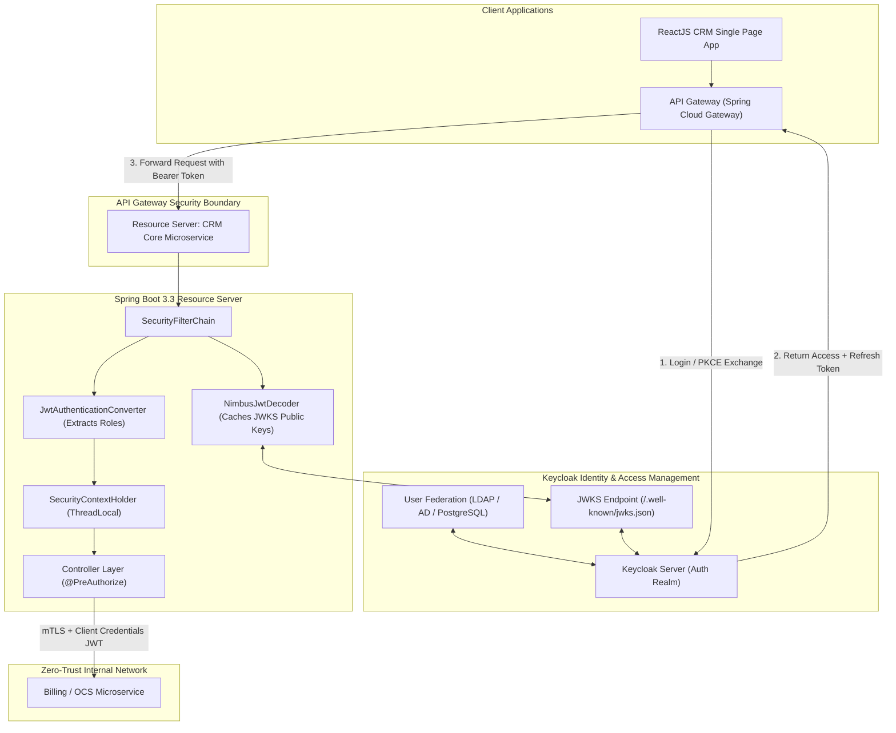

# 21. Enterprise Security, OAuth2 & Keycloak: Senior Architect Guide
> **Evidence warning:** The original resume supports secure coding, but not Keycloak/OAuth2 production ownership. Treat detailed deployments and metrics as learning scenarios.
**Target Profile:** Senior Product Software Engineer / Security-Conscious Backend Engineer (Spring Security 6.x, OAuth 2.1, OIDC, JWT Mechanics, Keycloak IAM, RBAC/ABAC, mTLS, OWASP Top 10)  
**Author:** Siva Prasad Vajja  
**Domain Alignment:** Telecom CRM, BSS Core Platform, Multi-Tenant SaaS, Financial Transactions, Zero-Trust Architecture  

---

## 1. Definition
**Enterprise Security at the Senior Product Engineer Level** is the rigorous discipline of implementing **Zero-Trust Architecture** ("never trust, always verify") across distributed microservices. It fundamentally decouples **Authentication (AuthN - Identity Verification)** from **Authorization (AuthZ - Permission & Entitlement Control)**.

In modern cloud-native architectures, enterprise security is anchored on:
* **OAuth 2.1 & OpenID Connect (OIDC):** The open industry standards for delegated authorization and federated identity.
* **JSON Web Tokens (JWT / RFC 7519):** Cryptographically signed, stateless, tamper-evident security assertions.
* **Keycloak IAM:** Centralized Identity and Access Management (IdP) managing single sign-on (SSO), user federation (LDAP/AD), realm multi-tenancy, and token lifecycles.
* **Spring Security 6.x:** The component-based, non-blocking servlet/filter architecture governing incoming requests, CORS/CSRF policies, and method-level access evaluations (`@PreAuthorize`).

---

## 2. Why It Exists
In distributed enterprise platforms (such as Telecom CRM, OCS, and BSS):
1. **The Death of Stateful Sessions (`JSESSIONID`):** In a Kubernetes cluster with 50 pod replicas, storing user sessions in local JVM memory mandates sticky sessions or expensive distributed Redis session clustering. Stateless JWTs allow any pod to authenticate requests independently in sub-milliseconds without cross-network lookups.
2. **The Microservice Propagation Problem:** When a customer triggers a SIM swap via the React UI, the request traverses the API Gateway, CRM Service, Billing Service, and HLR Provisioning. A cryptographically signed JWT propagates identity, tenant boundaries, and roles across network hops without re-authenticating at every hop.
3. **Regulatory Auditing & Compliance:** Telecommunications and FinTech systems often require strong auditability and controls. Centralized IAM can provide consistent authentication events, but authorization, application audit, retention, access reviews, and compliance evidence still require separate design and verification.

---

## 3. Problem It Solves
* **Broken Object Level Authorization (BOLA / IDOR):** Prevents Subscriber A from querying Subscriber B's bill by verifying identity claims against resource IDs in the service layer (`#msisdn == authentication.name`).
* **Secret Leakage & Replay Attacks:** Solved by short-lived access tokens (15 minutes), Refresh Token Rotation, and asymmetric cryptographic signing (RS256).
* **Cross-Origin & Injection Vulnerabilities:** Solved by strict CORS origin filtering, CSRF defense for stateful endpoints, and parameterized database queries.
* **Service-to-Service Impersonation:** Solved by mutual TLS (mTLS) with Istio/Envoy service meshes and OAuth2 Client Credentials grants.

---

## 4. Internal Working

### 4.1 Spring Security 6.x Filter Chain Architecture
Spring Security operates as a chain of servlet filters registered inside the `DelegatingFilterProxy`:

```
[ Inbound HTTP Request ]
           |
           v
[ 1. CorsFilter ]                     ---> Validates Origin, Access-Control-Allow-Methods
           |
           v
[ 2. HeaderWriterFilter ]             ---> Injects HSTS, X-Frame-Options, CSP Headers
           |
           v
[ 3. CsrfFilter ]                     ---> Validates CSRF token (disabled for stateless APIs)
           |
           v
[ 4. BearerTokenAuthenticationFilter] ---> Extracts Bearer token from 'Authorization' header
           |                          ---> Invokes NimbusJwtDecoder to verify signature & claims
           |
           v
[ 5. SecurityContextHolderFilter ]    ---> Populates SecurityContextHolder with Authentication token
           |
           v
[ 6. AuthorizationFilter ]           ---> Evaluates request matchers (.requestMatchers("/api/admin/**"))
           |
           v
[ DispatcherServlet -> Controller ]  ---> Enforces method security (@PreAuthorize)
```

### 4.2 Anatomy of a Cryptographic JWT (RFC 7519)
A JWT consists of three Base64URL-encoded parts separated by periods (`.`):
$$\text{JWT} = \text{Header} \, . \, \text{Payload} \, . \, \text{Signature}$$

```
+----------------------------------------------------------------------------------------------------+
| 1. HEADER (Algorithm & Token Type)                                                                |
|    { "alg": "RS256", "typ": "JWT", "kid": "keycloak-2026-key-1" }                                  |
+----------------------------------------------------------------------------------------------------+
| 2. PAYLOAD (Claims & Identity Attributes)                                                          |
|    {                                                                                               |
|      "sub": "user_9845012345",                                                                     |
|      "iss": "https://auth.telecom.sixdee.com/realms/crm-telecom",                                  |
|      "tenant_id": "TELCO_VODAFONE",                                                                |
|      "realm_access": { "roles": ["ROLE_CRM_AGENT", "ROLE_BILLING_VIEW"] },                         |
|      "exp": 1789456200,                                                                            |
|      "iat": 1789455300                                                                             |
|    }                                                                                               |
+----------------------------------------------------------------------------------------------------+
| 3. SIGNATURE (Asymmetric Verification)                                                             |
|    RSASHA256( Base64Url(Header) + "." + Base64Url(Payload), PrivateKey )                          |
+----------------------------------------------------------------------------------------------------+
```
* **RS256 (Asymmetric) vs. HS256 (Symmetric):**
  - **HS256 (Shared Secret):** Every microservice must know the secret password to verify tokens. If one microservice is compromised, the attacker can forge administrative tokens for the entire ecosystem.
  - **RS256 (Public/Private Key Pair):** Keycloak signs tokens using its **Private Key**. Microservices only require Keycloak's **Public Key** (fetched via JWKS: `/.well-known/jwks.json`). Microservices can verify signatures locally with zero risk of token forgery.

### 4.3 Modern OAuth 2.1 Authorization Flows
1. **Authorization Code Flow with PKCE (Proof Key for Code Exchange):**
   - The mandatory standard for Single Page Applications (React) and mobile apps.
   - Eliminates client secrets from browser environments. Generates a dynamic cryptographic `code_verifier` and `code_challenge` to prevent authorization code interception.
2. **Client Credentials Flow:**
   - Designed for Machine-to-Machine (M2M) communication (e.g., Spring Batch offline billing service calling Telecom OCS).
   - Microservice passes `client_id` and `client_secret` directly to Keycloak to obtain a service-scoped JWT.

---

## 5. Architecture



---

## 6. Important Components

| Component | Responsibility | Technical Implementation |
|---|---|---|
| **Identity Provider (IdP)** | Issues, rotates, and revokes tokens; manages user directories. | Keycloak 24+ / Okta / Azure AD. |
| **OAuth2 Resource Server** | Intercepts HTTP requests and validates JWT signatures against JWKS. | `spring-boot-starter-oauth2-resource-server` |
| **JWKS Public Key Cache** | Caches IdP public keys locally to avoid remote network latency per call. | Spring Security `NimbusJwtDecoder` with HTTP cache headers. |
| **Custom Role Converter** | Translates nested Keycloak JSON claims into Spring `GrantedAuthority` list. | Implements `Converter<Jwt, AbstractAuthenticationToken>`. |
| **Method Security Evaluator**| Enforces fine-grained domain-level authorization on Java service methods. | `@PreAuthorize("hasRole('ADMIN') and #tenantId == authentication.principal.claims['tenant_id']")` |

---

## 7. Example: Keycloak Role Claim Conversion in Java

Keycloak packages roles inside a nested JSON block:
```json
"realm_access": { "roles": ["CRM_ADMIN", "BILLING_SPECIALIST"] }
```
Spring Security expects authorities formatted as `ROLE_XXX`. We must map them cleanly:

```java
package com.sixdee.crm.security.converter;

import org.springframework.core.convert.converter.Converter;
import org.springframework.security.authentication.AbstractAuthenticationToken;
import org.springframework.security.core.GrantedAuthority;
import org.springframework.security.core.authority.SimpleGrantedAuthority;
import org.springframework.security.oauth2.jwt.Jwt;
import org.springframework.security.oauth2.server.resource.authentication.JwtAuthenticationToken;
import org.springframework.security.oauth2.server.resource.authentication.JwtGrantedAuthoritiesConverter;

import java.util.*;
import java.util.stream.Collectors;
import java.util.stream.Stream;

public class KeycloakJwtAuthenticationConverter implements Converter<Jwt, AbstractAuthenticationToken> {

    private final JwtGrantedAuthoritiesConverter defaultGrantedAuthoritiesConverter = new JwtGrantedAuthoritiesConverter();

    @Override
    public AbstractAuthenticationToken convert(Jwt jwt) {
        Collection<GrantedAuthority> authorities = Stream.concat(
            defaultGrantedAuthoritiesConverter.convert(jwt).stream(),
            extractKeycloakRealmRoles(jwt).stream()
        ).collect(Collectors.toSet());

        return new JwtAuthenticationToken(jwt, authorities, getPrincipalClaimName(jwt));
    }

    private String getPrincipalClaimName(Jwt jwt) {
        return jwt.hasClaim("preferred_username") ? jwt.getClaimAsString("preferred_username") : jwt.getSubject();
    }

    @SuppressWarnings("unchecked")
    private Collection<GrantedAuthority> extractKeycloakRealmRoles(Jwt jwt) {
        Map<String, Object> realmAccess = jwt.getClaim("realm_access");
        if (realmAccess == null || !realmAccess.containsKey("roles")) {
            return Collections.emptyList();
        }

        List<String> roles = (List<String>) realmAccess.get("roles");
        return roles.stream()
            .map(roleName -> new SimpleGrantedAuthority("ROLE_" + roleName.toUpperCase()))
            .collect(Collectors.toList());
    }
}
```

---

## 8. Java/Spring Boot Example: Production `SecurityFilterChain`

```java
package com.sixdee.crm.security.config;

import com.sixdee.crm.security.converter.KeycloakJwtAuthenticationConverter;
import org.springframework.context.annotation.Bean;
import org.springframework.context.annotation.Configuration;
import org.springframework.http.HttpMethod;
import org.springframework.security.config.Customizer;
import org.springframework.security.config.annotation.method.configuration.EnableMethodSecurity;
import org.springframework.security.config.annotation.web.builders.HttpSecurity;
import org.springframework.security.config.annotation.web.configuration.EnableWebSecurity;
import org.springframework.security.config.annotation.web.configurers.AbstractHttpConfigurer;
import org.springframework.security.config.http.SessionCreationPolicy;
import org.springframework.security.web.SecurityFilterChain;
import org.springframework.web.cors.CorsConfiguration;
import org.springframework.web.cors.CorsConfigurationSource;
import org.springframework.web.cors.UrlBasedCorsConfigurationSource;

import java.util.List;

@Configuration
@EnableWebSecurity
@EnableMethodSecurity(prePostEnabled = true)
public class EnterpriseSecurityConfiguration {

    @Bean
    public SecurityFilterChain securityFilterChain(HttpSecurity http) throws Exception {
        http
            // 1. Disable CSRF for stateless REST APIs using JWT
            .csrf(AbstractHttpConfigurer::disable)

            // 2. Enable CORS with strict configuration
            .cors(cors -> cors.configurationSource(corsConfigurationSource()))

            // 3. Enforce stateless session policy (No JSESSIONID)
            .sessionManagement(session -> session.sessionCreationPolicy(SessionCreationPolicy.STATELESS))

            // 4. Configure URL authorization matchers
            .authorizeHttpRequests(auth -> auth
                .requestMatchers("/actuator/health", "/actuator/info").permitAll()
                .requestMatchers("/v3/api-docs/**", "/swagger-ui/**").permitAll()
                .requestMatchers(HttpMethod.GET, "/api/v1/plans/public/**").permitAll()
                .requestMatchers("/api/v1/admin/**").hasRole("CRM_ADMIN")
                .anyRequest().authenticated()
            )

            // 5. Configure OAuth2 Resource Server with Keycloak converter
            .oauth2ResourceServer(oauth2 -> oauth2
                .jwt(jwt -> jwt.jwtAuthenticationConverter(new KeycloakJwtAuthenticationConverter()))
            );

        return http.build();
    }

    @Bean
    public CorsConfigurationSource corsConfigurationSource() {
        CorsConfiguration config = new CorsConfiguration();
        config.setAllowedOrigins(List.of("https://crm.telecom.sixdee.com"));
        config.setAllowedMethods(List.of("GET", "POST", "PUT", "DELETE", "OPTIONS"));
        config.setAllowedHeaders(List.of("Authorization", "Content-Type", "X-Tenant-ID"));
        config.setExposedHeaders(List.of("X-Trace-ID"));
        config.setAllowCredentials(true);
        config.setMaxAge(3600L);

        UrlBasedCorsConfigurationSource source = new UrlBasedCorsConfigurationSource();
        source.registerCorsConfiguration("/**", config);
        return source;
    }
}
```

---

## 9. Production Use Case: Multi-Tenant Telecom CRM Security
In **6D Technologies CRM platforms**:
1. **The Infrastructure:** A single multi-tenant deployment services 5 different regional telecom operators.
2. **The Security Enforcement:**
   - Keycloak provisions an isolated **Realm** per operator, or a unified realm with a custom `tenant_id` claim in the JWT.
   - A call center representative from Operator A authenticates via Keycloak SSO; their JWT contains: `"tenant_id": "TELCO_OP_A"`.
   - On the Spring Boot backend, a method-level security evaluator enforces:
     ```java
     @PreAuthorize("hasRole('AGENT') and #request.tenantId == authentication.principal.claims['tenant_id']")
     @PostMapping("/subscribers/{msisdn}/adjust-balance")
     public ResponseEntity<Void> adjustBalance(@PathVariable String msisdn, @RequestBody BalanceRequest request) { ... }
     ```
   - Even if a malicious agent attempts to modify a subscriber belonging to Operator B, Spring Security intercepts the call and returns an immediate `403 Forbidden` before executing any business logic.

---

## 10. Common Mistakes in Enterprise Security

| Anti-Pattern | Vulnerability | Senior Engineering Fix |
|---|---|---|
| **`allowedOrigins("*")` + `allowCredentials(true)`** | CORS misconfiguration permitting cross-origin credential theft. | Specify exact production origin domains explicitly in `CorsConfigurationSource`. |
| **Storing Sensitive Data in JWT Payload** | Exposing passwords, credit cards, or internal network IPs in Base64 plaintext. | JWT payloads are readable by anyone. Store only opaque UUIDs, tenant IDs, and role names. |
| **Long Access Token TTLs (24h+)** | If a token is stolen, the attacker has unrestricted access for 24 hours. | Keep access tokens short-lived (**15 minutes**). Use Refresh Tokens with rotation to renew. |
| **Disabling CSRF on Stateful Cookie Apps** | Cross-Site Request Forgery attacks. | Only disable CSRF on strictly stateless REST APIs where authentication relies solely on `Authorization: Bearer`. |
| **Missing Method-Level Security** | Relying only on URL matching (`/api/**`); missing domain ownership checks. | Enable `@EnableMethodSecurity` and assert record-level ownership in `@PreAuthorize`. |

---

## 11. Performance Considerations

### 11.1 JWKS (JSON Web Key Set) Public Key Caching
* When validating RS256 JWTs, the resource server must obtain Keycloak's public RSA key.
* **Never query Keycloak's JWKS endpoint over HTTP on every incoming request!**
* Spring Security's `NimbusJwtDecoder` automatically caches the JWKS public keys in memory, respecting standard HTTP `Cache-Control` response headers emitted by Keycloak (typically 24-hour TTL). Signature validation executes in **$< 0.1$ms of CPU time** in local memory.

### 11.2 Header Size & Network Bandwidth
* Embedding 50 enterprise roles or massive user metadata into a JWT payload creates tokens exceeding 4 KB.
* In high-throughput architectures (10,000 TPS), transmitting a 4KB header adds significant TCP bandwidth overhead.
* *Senior Rule:* Keep JWT payloads minimal: `sub`, `tenant_id`, `scope`, and essential role arrays. Query secondary user profile attributes from Redis or local database when needed.

---

## 12. Security Considerations: The OWASP Top 10 for APIs

```
+----------------------------------------------------------------------------------------------------+
|                                    OWASP API TOP 10 MITIGATION                                     |
+----------------------------------------------------------------------------------------------------+
| 1. BOLA (Broken Object Level Auth) | Enforce ownership checks in Java: #id == auth.principal.id.   |
| 2. Broken Authentication           | Enforce PKCE, short token TTLs, and Refresh Token Rotation.     |
| 3. Broken Object Property Auth     | DTO projection: Never bind raw incoming JSON directly to JPA.  |
| 4. Unrestricted Resource Consump.  | Rate limiting via Redis Token Bucket + max page sizes in SQL.  |
| 5. Broken Function Level Auth      | Role validation via @PreAuthorize("hasRole('ADMIN')").        |
| 6. Server-Side Request Forgery     | Whitelist outgoing URLs; block internal cloud metadata IPs.    |
| 7. Security Misconfiguration       | Disable Swagger in production; enforce strict HSTS and CORS.   |
+----------------------------------------------------------------------------------------------------+
```

---

## 13. Core Interview Questions (With Senior Answers)

### Q1: What is the architectural difference between Authentication and Authorization?
**Answer:** Authentication (AuthN) is the process of verifying *who a user or service is* (e.g., validating credentials via Keycloak and issuing a signed JWT assertion). Authorization (AuthZ) is the process of determining *what permissions and actions that authenticated identity is permitted to perform* (e.g., verifying via Spring Security's `AuthorizationFilter` and `@PreAuthorize` whether the caller possesses the `ROLE_CRM_SUPERVISOR` authority required to issue a credit).

### Q2: Why is the Authorization Code Flow with PKCE preferred over the Implicit Flow for modern SPAs?
**Answer:** The legacy Implicit Flow returned the access token directly in the browser's URL fragment (`#access_token=...`), exposing tokens to browser history, browser extensions, and network referrer leakage. Furthermore, it lacked client verification. The Authorization Code Flow with PKCE (Proof Key for Code Exchange) generates a dynamic cryptographic secret (`code_verifier`) and sends its hash (`code_challenge`) during authorization. The token is exchanged via a direct backchannel POST request, mathematically preventing authorization code interception without requiring a hardcoded client secret in frontend code.

### Q3: How do you revoke a stateless JWT before its natural expiration time?
**Answer:** Because JWTs are stateless and verified cryptographically without database lookups, they cannot be natively "deleted". In production, we implement **Token Blacklisting / Revocation via Redis**:
1. When a user logs out or is suspended, Keycloak emits a `UserLoggedOutEvent` to a Kafka topic.
2. A Spring Boot worker receives the event and writes the JWT ID (`jti`) to a Redis distributed set with a TTL matching the token's remaining lifespan: `SETEX blacklist:{jti} {remaining_seconds} "revoked"`.
3. A custom Spring Security filter checks Redis for the token's `jti`. If present, it rejects the request with HTTP 401.

### Q4: What is the difference between RBAC and ABAC?
**Answer:** RBAC (Role-Based Access Control) assigns static permissions to roles (e.g., `ROLE_ADMIN`, `ROLE_AGENT`). Access decisions check only whether the user holds that role (`hasRole('ADMIN')`). ABAC (Attribute-Based Access Control) evaluates dynamic contextual attributes: user attributes (department, clearance), resource attributes (account owner, document classification), and environmental attributes (time of day, client IP location). ABAC allows fine-grained rules: *"An agent can only modify a subscriber account if the agent and subscriber share the same `tenant_id` and the transaction occurs during business hours."*

---

## 14. Deep Architectural Interview Questions (Senior/Staff Level)

### Q1: How do you implement Zero-Trust mutual TLS (mTLS) combined with OAuth2 in an enterprise Kubernetes service mesh?
**Answer:**  
"In an enterprise Zero-Trust mesh (using Istio or Envoy):
1. **mTLS (Network Transport Layer):** Istio sidecar proxies automatically establish mutual TLS encryption for all pod-to-pod traffic. Istio injects short-lived X.509 certificates to each pod via the SPIFFE/SPIRE standard, validating machine identity and encrypting data-in-transit.
2. **OAuth2 JWT (Application Layer AuthZ):** While mTLS proves *Pod A is communicating with Pod B*, it does not represent the human user. The API Gateway forwards the user's Bearer JWT across microservice boundaries.
3. **Defense-in-Depth:** Each internal microservice validates both:
   - **Envoy/Istio AuthorizationPolicy:** Asserts that incoming mTLS connections originate only from authorized service principals.
   - **Spring Security:** Validates the application-level JWT, extracting user claims and evaluating business entitlements."

### Q2: How do you handle Refresh Token Rotation and detect Refresh Token Replay attacks?
**Answer:**  
"In Keycloak and enterprise IAM systems:
1. **Rotation:** Whenever a client exchanges a Refresh Token for a new Access Token, Keycloak immediately invalidates that Refresh Token and issues a brand-new Refresh Token alongside the new Access Token.
2. **Replay Detection:** Keycloak stores the family genealogy of tokens. If an attacker intercepts an old, invalidated Refresh Token and attempts to exchange it, Keycloak detects that an already-consumed token is being re-used.
3. **Automated Session Revocation:** Keycloak immediately assumes the entire token family has been compromised: it revokes the active refresh token, terminates the user's active session, invalidates all child tokens, and triggers a high-severity security alert requiring the legitimate user to re-authenticate."

---

## 15. Comparison of Authentication Mechanisms

| Dimension | JWT (Stateless OAuth2) | Server-Side Sessions (`JSESSIONID`) | API Keys | Paseto (Platform-Agnostic Tokens) |
|---|---|---|---|---|
| **Storage** | Client memory / Secure Cookie | Server RAM / Redis | Client header | Client memory |
| **Scalability** | Infinite (Stateless verification) | Requires centralized session cache | High | Infinite |
| **Revocation** | Difficult (Requires Redis blacklist) | Instant (Delete session key) | Instant (DB toggle) | Difficult |
| **Payload** | Rich domain claims (Roles, Tenant) | Opaque session ID | Opaque string | Cryptographically strict payload |
| **Standards Fit** | Universal (OAuth 2.1 / OIDC) | Monolithic Java standard | Legacy M2M | Modern cryptographic alternative |

---

## 16. When NOT to Use Stateless JWTs
1. **Internal Monolithic Web Applications:** If an internal administrative portal runs on a single server or small cluster with server-rendered HTML (Thymeleaf/Spring MVC), traditional stateful `JSESSIONID` sessions with Spring Security CSRF protection are simpler and support instant logout without Redis blacklists.
2. **High-Security Immediate Revocation Systems:** High-frequency stock trading consoles where user permissions must be revocable within milliseconds without maintaining secondary token blacklist caches.

---

## 17. Hands-On Exercise: Unit Testing `@PreAuthorize` with Spring Security Test

```java
package com.sixdee.crm.security;

import org.junit.jupiter.api.DisplayName;
import org.junit.jupiter.api.Test;
import org.springframework.beans.factory.annotation.Autowired;
import org.springframework.boot.test.context.SpringBootTest;
import org.springframework.security.access.AccessDeniedException;
import org.springframework.security.test.context.support.WithMockUser;

import static org.assertj.core.api.Assertions.assertThat;
import static org.assertj.core.api.Assertions.assertThatThrownBy;

@SpringBootTest
class SecurityAuthorizationTest {

    @Autowired
    private BillingAdjustmentService billingService;

    @Test
    @DisplayName("Agent with ROLE_CRM_AGENT should successfully view subscriber balance")
    @WithMockUser(username = "agent_john", roles = {"CRM_AGENT"})
    void testAgentCanViewBalance() {
        String balance = billingService.getBalance("9845012345");
        assertThat(balance).isNotNull();
    }

    @Test
    @DisplayName("Agent without ROLE_CRM_ADMIN should be denied when attempting credit adjustment")
    @WithMockUser(username = "agent_john", roles = {"CRM_AGENT"})
    void testAgentCannotApplyWaiver() {
        assertThatThrownBy(() -> billingService.applyWaiver("9845012345", 50.0))
            .isInstanceOf(AccessDeniedException.class);
    }
}
```

---

## 18. Project Application: Telecom CRM Core Platform
Illustrative enterprise security project application (not current 6D production evidence):
* **Federated Identity via Keycloak:**
  - Deployed Keycloak as the centralized IdP, federating telecom operator active directories via LDAP.
  - Replaced legacy session-based authentication with OAuth 2.1 Authorization Code Flow with PKCE for the React CRM frontend.
  - Illustrative security exercise: apply a shared JWT-to-authority converter across services, then prove authorization and tenant isolation with negative tests; do not claim this was implemented across production services without evidence.

---

## 19. Senior-Level Interview Answer (The "Gold Standard")

> *"In enterprise distributed architectures, I design security around Zero-Trust principles using OAuth 2.1, OIDC, and Keycloak as our centralized Identity Provider.  
>  
> *Rather than managing stateful sessions, our Spring Boot microservices operate as stateless OAuth2 Resource Servers. We validate incoming JWT signatures locally using Keycloak's public keys via the JWKS endpoint, leveraging NimbusJwtDecoder's built-in in-memory caching to achieve sub-millisecond validation without remote network calls. We map Keycloak realm roles into Spring Security granted authorities using a custom converter.  
>  
> *To guard against Broken Object Level Authorization (BOLA), we enforce method-level security using `@PreAuthorize`, verifying not just that the user has a valid role, but that their JWT tenant and identity claims match the domain entity being accessed. For sensitive operations, we enforce short 15-minute access token lifespans coupled with Refresh Token Rotation, and secure internal microservice traffic via mutual TLS."*

---

## 20. Real-World Troubleshooting Scenarios

### Scenario A: Intermittent `401 Unauthorized` Caused by Clock Skew
* **Symptom:** Microservices reject valid tokens with `JwtValidationException: Jwt was expired at...` even though the user just logged in 2 seconds ago.
* **Root Cause:** Microservice host clock was out of synchronization with the Keycloak server clock by 4 seconds. The JWT `nbf` (Not Before) or `exp` timestamp was deemed invalid.
* **Fix:** Configure clock skew tolerance in the JWT decoder:
  ```java
  @Bean
  public JwtDecoder jwtDecoder() {
      NimbusJwtDecoder decoder = NimbusJwtDecoder.withJwkSetUri(jwkSetUri).build();
      OAuth2TokenValidator<Jwt> withClockSkew = new DelegatingOAuth2TokenValidator<>(
          new JwtTimestampValidator(Duration.ofSeconds(60)) // 60s tolerance
      );
      decoder.setJwtValidator(withClockSkew);
      return decoder;
  }
  ```

### Scenario B: CORS Preflight Failure (`OPTIONS 403 Forbidden`) from React App
* **Symptom:** React frontend cannot call backend APIs; browser console displays `CORS preflight request failed with status 403`.
* **Root Cause:** Spring Security intercepted the browser's HTTP `OPTIONS` preflight request and required authentication before `CorsFilter` could process the headers.
* **Fix:** Ensure `CorsFilter` is placed at the very beginning of the filter chain, or explicitly allow preflight requests in the security DSL:
  ```java
  .authorizeHttpRequests(auth -> auth.requestMatchers(CorsUtils::isPreFlightRequest).permitAll()...)
  ```

### Scenario C: Token Signing Key Rotation Outage
* **Symptom:** When the security team rotated Keycloak's RSA signing keys, all backend microservices immediately began failing with `JwtException: Signed JWT rejected: Invalid signature`.
* **Root Cause:** The microservices cached the old JWKS public key and did not refresh their key cache upon encountering a token signed with the new `kid` (Key ID).
* **Fix:** Ensure the `NimbusJwtDecoder` is configured with dynamic JWKS selector reload, which automatically fetches the new public key from Keycloak upon encountering an unknown `kid` in the token header.
