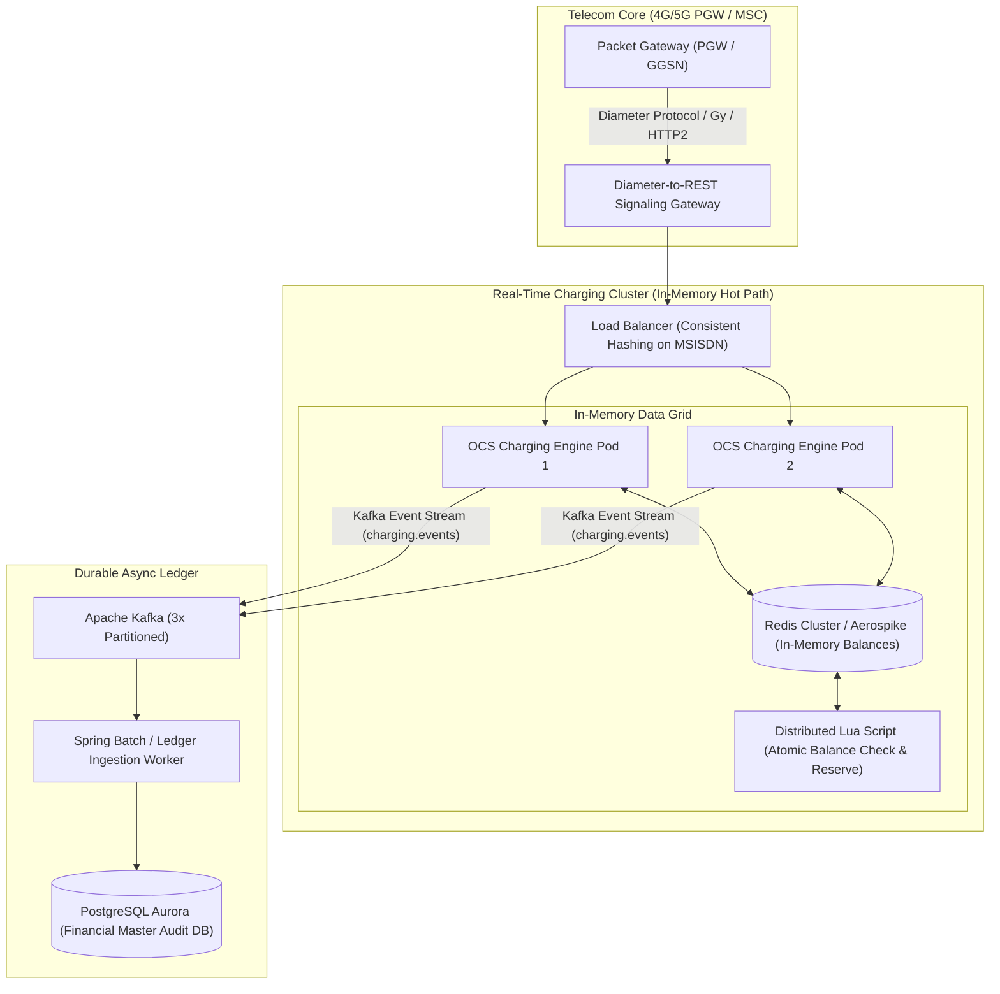
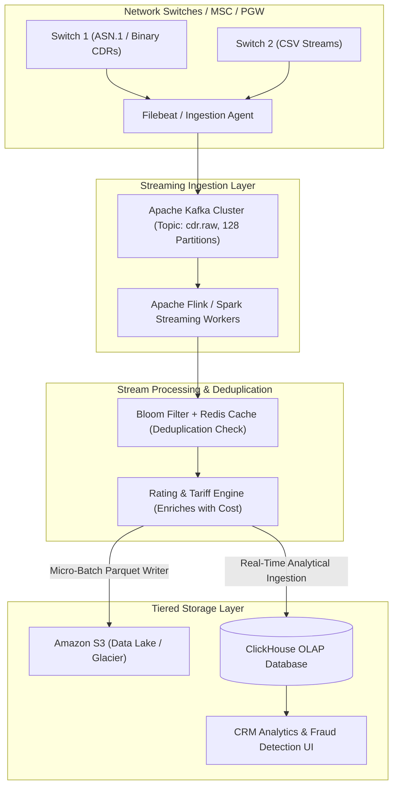
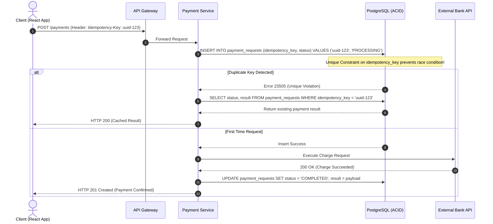
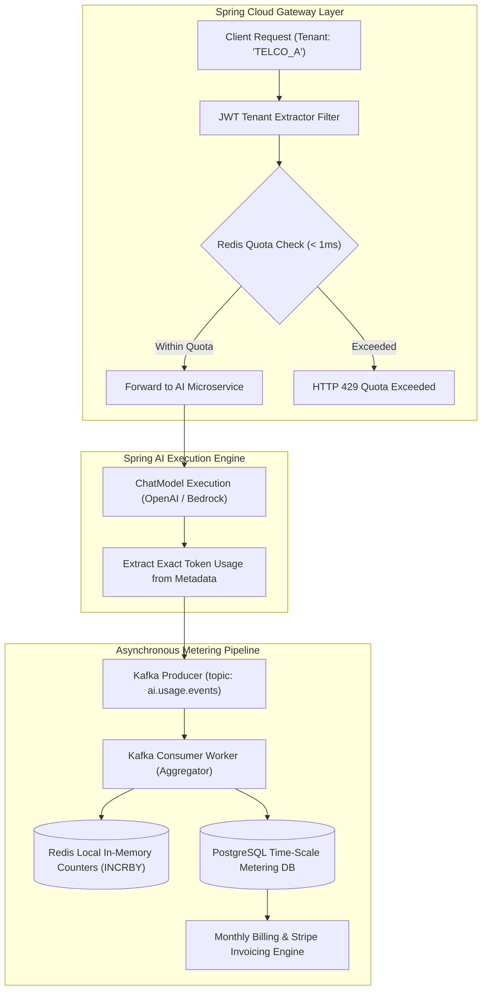
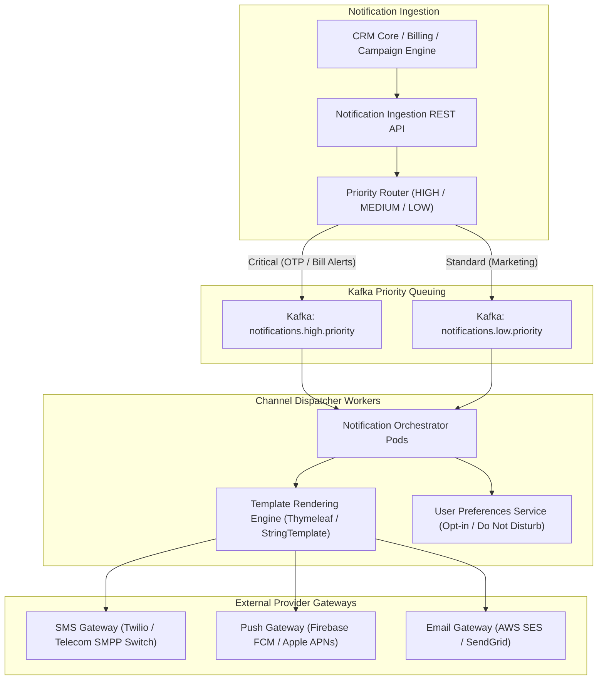

# 23. Master System Design Catalog: Senior & Staff Engineer Blueprints
> **Evidence warning:** These are design blueprints. Requirements, scale, and outcomes are hypothetical unless explicitly marked and evidenced.
**Target Profile:** Senior Product Software Engineer / AI-Enabled Backend Engineer (High-Throughput Distributed Systems, Scalability, Fault Tolerance, Consistency Models)  
**Author:** Siva Prasad Vajja  
**Domain Alignment:** Telecom CRM/OCS, Distributed FinTech Ledgers, Multi-Tenant SaaS, Real-Time Streaming  

---

## System Design Interview Framework (The 6-Step Structure)
In Tier-1 product company System Design rounds (45–60 minutes), interviewers evaluate how you drive ambiguous requirements to an authoritative production architecture. Every design in this catalog adheres to the **Senior Framework**:
1. **Requirements Clarification:** Functional (Core APIs) vs. Non-Functional (Throughput, Latency SLAs, CAP/PACELC, Availability).
2. **Capacity Estimation (Back-of-the-Envelope):** QPS, Write/Read ratios, Network Bandwidth, 5-Year Storage Sizing.
3. **API & Interface Signatures:** REST/gRPC endpoints, idempotent headers, request/response DTOs.
4. **Data Modeling & Storage Engine Choice:** SQL vs. NoSQL vs. Time-Series vs. Distributed In-Memory Key-Value.
5. **High-Level Architectural Topology:** End-to-end Mermaid system diagram showing load balancers, caches, queues, and workers.
6. **Deep-Dive into Bottlenecks & Failure Recovery:** Data partitioning (sharding keys), cache stampede mitigation, split-brain resolution, and disaster recovery.

---

## Blueprint 1: Real-Time Telecom Online Charging System (OCS)

### 1. Requirements & System Context
* **Functional:**
  1. Inspect subscriber balance in real-time before granting voice/data session.
  2. Deduct prepaid balances concurrently during active streaming sessions.
  3. Support balance reservation and commit/rollback (Two-Phase Reservation).
* **Non-Functional:**
  - **Throughput:** 50,000 requests/sec (peak).
  - **Latency SLA:** P99 $< 15$ms (Telephony network timeouts occur if $> 20$ms).
  - **Consistency:** Strong Consistency ($C$ in CAP) for balance deductions (no double spending).
  - **Availability:** 99.999% (Five Nines - $< 5.26$ minutes downtime/year).

### 2. Capacity Estimation
* 50,000 QPS $\times$ 500 bytes/request = **25 MB/sec ingress** (200 Mbps network bandwidth).
* Active subscribers: 50,000,000. Balance record: 200 bytes $\to$ **10 GB active working set in RAM**.

### 3. Architectural Topology



### 4. Deep-Dive: Zero-Latency Atomic Deduction via Redis Lua
To achieve $< 5$ms balance reservation without distributed 2PC locks, we execute an atomic Lua script inside the subscriber's assigned Redis shard:

```lua
-- KEYS[1]: subscriber:balance:{msisdn}
-- ARGV[1]: deduction_amount
-- ARGV[2]: reservation_id

local current_balance = tonumber(redis.call('GET', KEYS[1]))
local deduct = tonumber(ARGV[1])

if current_balance == nil then
    return -1 -- Subscriber not found
end

if current_balance >= deduct then
    redis.call('DECRBY', KEYS[1], deduct)
    redis.call('HSET', 'reservations:' .. KEYS[1], ARGV[2], deduct)
    return current_balance - deduct
else
    return -2 -- Insufficient balance (Cut off call)
end
```
* **Failure Recovery:** If the OCS pod crashes mid-session, Kafka consumer offset replay reconciles the master PostgreSQL ledger against the in-memory Redis state.

---

## Blueprint 2: High-Throughput CDR Ingestion Pipeline (100,000 Events/Sec)

### 1. Requirements & System Context
* **Functional:** Ingest, parse, deduplicate, rate, and store 100,000 Call Detail Records (CDRs) per second from telecommunications switches.
* **Non-Functional:**
  - **Scale:** 100,000 events/sec = 8.64 Billion CDRs/day.
  - **Latency:** Near real-time analytical visibility ($< 30$ seconds end-to-end).
  - **Storage:** 5-Year retention for regulatory compliance.

### 2. Capacity Estimation
* 100,000 events/sec $\times$ 300 bytes/event = **30 MB/sec** (2.59 TB uncompressed/day).
* 5-Year Storage: $2.59 \text{ TB} \times 365 \times 5 \approx \mathbf{4.7 \text{ PB}}$. (Mandates columnar compression like Apache Parquet).

### 3. Architectural Topology



### 4. Deep-Dive: Exactly-Once Processing & Deduplication
1. **Deduplication:** A composite hash key `SHA256(switch_id + sequence_no + timestamp)` is checked against an in-memory Bloom filter. If positive, verified against Redis with a 1-hour TTL.
2. **Columnar Partitioning in ClickHouse:** Partitioned by `toYYYYMM(event_date)` and sorted by `(tenant_id, subscriber_id, event_time)`. This enables scanning 1 billion CDRs in under 200ms for CRM billing queries.

---

## Blueprint 3: Distributed Rate Limiter & Token Bucket

### 1. Requirements & System Context
* **Functional:** Enforce API rate limits per tenant/IP (e.g., 1,000 requests/minute). Return HTTP 429 when exceeded.
* **Non-Functional:** Sub-millisecond latency overhead ($< 1$ms added to request path), distributed state across multiple gateway instances.

### 2. Architectural Comparison: Sliding Window Log vs. Token Bucket
* **Sliding Window Log:** Stores individual timestamps in Redis Sorted Sets (`ZADD`). Extremely accurate, but memory-intensive ($O(N)$ memory per user).
* **Token Bucket (Recommended for Enterprise):** Tracks two numbers: `last_refill_time` and `available_tokens`. Memory footprint is constant ($O(1)$ - 16 bytes per user).

### 3. Low-Latency Sliding Window Script in Redis
```lua
-- KEYS[1]: rate_limit:{user_id}
-- ARGV[1]: max_capacity
-- ARGV[2]: refill_rate (tokens per second)
-- ARGV[3]: current_timestamp

local key = KEYS[1]
local capacity = tonumber(ARGV[1])
local refill_rate = tonumber(ARGV[2])
local now = tonumber(ARGV[3])

local data = redis.call('HMGET', key, 'tokens', 'last_updated')
local tokens = tonumber(data[1])
local last_updated = tonumber(data[2])

if tokens == nil then
    tokens = capacity
    last_updated = now
else
    local elapsed = math.max(0, now - last_updated)
    tokens = math.min(capacity, tokens + elapsed * refill_rate)
    last_updated = now
end

if tokens >= 1 then
    tokens = tokens - 1
    redis.call('HMSET', key, 'tokens', tokens, 'last_updated', last_updated)
    redis.call('EXPIRE', key, 3600)
    return 1 -- Allowed
else
    return 0 -- Throttled (HTTP 429)
end
```

---

## Blueprint 4: Idempotent Distributed Payment Gateway

### 1. Requirements & System Context
* **Functional:** Process credit card / bank debits, communicate with third-party payment processors (Stripe/Bank APIs), emit receipts.
* **Non-Functional:** **Strict Zero Double-Charging Guarantee**, high availability, auditability.

### 2. Architectural Topology



### 3. Failure Mode: Handling Network Timeouts between Service and Bank
* **The Danger:** Payment Service calls Bank, but network times out before receiving the response. Did the bank charge the customer?
* **The Solution (Reconciliation & Outbox):**
  1. Record transaction state as `PENDING_VERIFICATION`.
  2. A background reconciler worker polls the Bank's `GET /charges/{idempotency_key}` endpoint with exponential backoff.
  3. The transaction is marked `COMPLETED` or `FAILED` only after definitive bank status confirmation.

---

## Blueprint 5: Multi-Tenant SaaS Quota & Token Metering Engine

### 1. Requirements & System Context
* **Functional:** Track API calls and AI token usage across 500+ enterprise tenants. Enforce tier limits (e.g., Bronze: 1M tokens/mo, Platinum: 50M tokens/mo).
* **Non-Functional:** Resilient against single-tenant noisy-neighbor saturation; zero impact on LLM streaming latency.

### 2. Architectural Topology



---

## Blueprint 6: Distributed Lock Manager (Redlock vs. ZooKeeper)

### 1. When do you need a Distributed Lock?
When multiple microservice instances must coordinate access to an un-partitioned shared resource (e.g., executing a single scheduled cron job across a 10-pod cluster, or preventing simultaneous SIM activation commands on the same subscriber).

### 2. Architectural Comparison: Redis Redlock vs. ZooKeeper / etcd

| Dimension | Redis Redlock | ZooKeeper / etcd |
|---|---|---|
| **Consensus Model** | Probabilistic (N/2 + 1 node agreement) | Proven Consensus (Raft / ZAB) |
| **Clock Sensitivity** | **High** (Susceptible to clock drift & GC pauses) | **Zero** (Relies on logical epochs/session leases) |
| **Split-Brain Risk** | Non-zero during network partitions | Zero (CP in CAP theorem) |
| **Throughput** | Ultra-high (100,000 locks/sec) | Moderate (5,000 locks/sec) |
| **Recommendation** | Caching, rate limiting, non-financial tasks | Financial transactions, master node elections |

### 3. The Martin Kleppmann GC Pause Hazard & Fencing Tokens
If a thread acquires a distributed lock, enters a long Stop-the-World GC pause, the lock expires in Redis, and a second thread acquires the lock. Thread 1 wakes up and commits an invalid mutation!
* **The Solution (Fencing Tokens):** Every lock grant increments a monotonic counter (`fencing_token`). The database verifies that writes carry a fencing token strictly greater than the last committed transaction:
  ```sql
  UPDATE subscriber_state SET state = 'ACTIVE', last_fencing_token = :token 
  WHERE msisdn = :msisdn AND last_fencing_token < :token;
  ```

---

## Blueprint 7: Enterprise Notification Engine

### 1. Requirements & System Context
* **Functional:** Transmit notifications across multiple channels (SMS, Email, Push Notifications, In-App). Support priority queues, templating, and localized delivery time windows.
* **Scale:** 10,000,000 notifications daily; peak bursts during promotional events.

### 2. Architectural Topology



---

## Blueprint 8: Scalable Webhook Delivery System with Exponential Backoff

### 1. Requirements & System Context
* Deliver asynchronous event payloads (e.g., `payment.success`, `sim.activated`) to third-party customer HTTP endpoints reliably.
* Handle subscriber endpoints that are slow, down, or returning 500 errors without blocking other tenants.

### 2. The Dead-Letter Queue (DLQ) & Delayed Retry Topology
```
[ Ingest Event ] ---> [ Active Queue ] ---> [ Dispatch Worker ] ---> Third-Party Endpoint
                                                   |
                                            (Failed: 504 Timeout)
                                                   |
                                                   v
[ Delayed Queue 1 (Wait 10s) ] <-------------------+
      |
(Retry 1 Failed)
      |
      v
[ Delayed Queue 2 (Wait 60s) ]
      |
(Retry 2 Failed)
      |
      v
[ Delayed Queue 3 (Wait 15m) ]
      |
(Max Retries Exceeded)
      |
      v
[ Dead Letter Queue (DLQ) ] ---> Alert Operator & Display in Webhook Dashboard
```
* **Implementation Detail:** Leverage **RabbitMQ Dead Letter Exchanges** with message TTLs or **Amazon SQS Delay Queues** to implement zero-CPU delayed retry scheduling.

---

## Blueprint 9: Real-Time Distributed Telemetry & Metrics Aggregator

### 1. Requirements & System Context
* Ingest metric counters, histograms, and distributed traces from 200 microservice pods.
* Support sub-second alerting and historical dashboard visualization in Grafana.

### 2. Architecture: OpenTelemetry + Prometheus + Thanos
```
[ App Pod 1 (Micrometer) ] --+
[ App Pod 2 (Micrometer) ] --+--> [ OpenTelemetry (OTel) DaemonSet Collector ]
                             |         | (Batched OTLP Protocol)
                             |         v
                             |    [ Prometheus Server (Local Scrape, 2-hour retention) ]
                             |         |
                             |         v
                             +--> [ Thanos Sidecar ] ---> [ Amazon S3 (Long-Term TSDB) ]
                                       |
                                       v
                                  [ Grafana Query Dashboard ]
```

---

## Blueprint 10: E-Commerce / Flash Sale Hot-Item Inventory Reservation

### 1. Requirements & System Context
* 100,000 users attempting to buy 500 discounted smartphones in 10 seconds.
* Zero overselling; deterministic checkout timers (10 minutes to pay before releasing item).

### 2. High-Performance Architecture
1. **Never write to SQL on the critical path.**
2. **Pre-warm Inventory in Redis:** `SET phone_stock:item_101 500`.
3. **Atomic Decrement (`DECR`):**
   ```java
   long remaining = redisTemplate.opsForValue().decrement("phone_stock:item_101");
   if (remaining < 0) {
       // Out of stock!
       return ResponseEntity.status(410).body("Sold Out");
   }
   // Stock reserved! Issue 10-minute payment token.
   ```
4. **Checkout Expiry via Redis Key Expiration (`EXPIRE`):** If customer does not pay within 10 minutes, Redis expiration keyspace notification triggers a worker to increment inventory back (`INCR`).

---

## Master System Design Cheat Sheet for Interviews

| System Design Challenge | Recommended Pattern | Technology Choice |
|---|---|---|
| **Ultra-Low Latency State (< 10ms)** | In-Memory Key-Value | Redis Cluster / Aerospike |
| **High-Throughput Streaming (> 50k TPS)** | Partitioned Append-Only Log | Apache Kafka / Apache Flink |
| **Read-Heavy Catalog (> 95% reads)** | Read Replicas + Edge CDN | CloudFront + PostgreSQL Read Pool |
| **Write-Heavy Timeseries / Logs** | Columnar Append-Only | ClickHouse / InfluxDB |
| **Transactional Financial Ledgers** | Double-Entry ACID Relational | PostgreSQL Aurora Multi-AZ |
| **Cross-Microservice Distributed Transactions**| Saga Pattern (Orchestration) | Camunda BPMN / Kafka Outbox |
| **Large Unstructured Binary Storage** | Content-Addressable Object Store | Amazon S3 with Pre-signed URLs |
